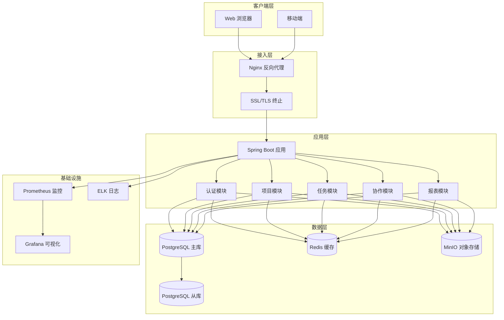
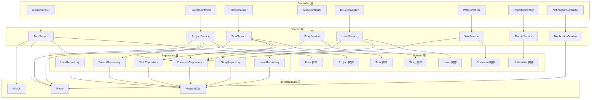
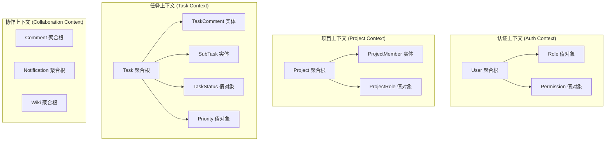
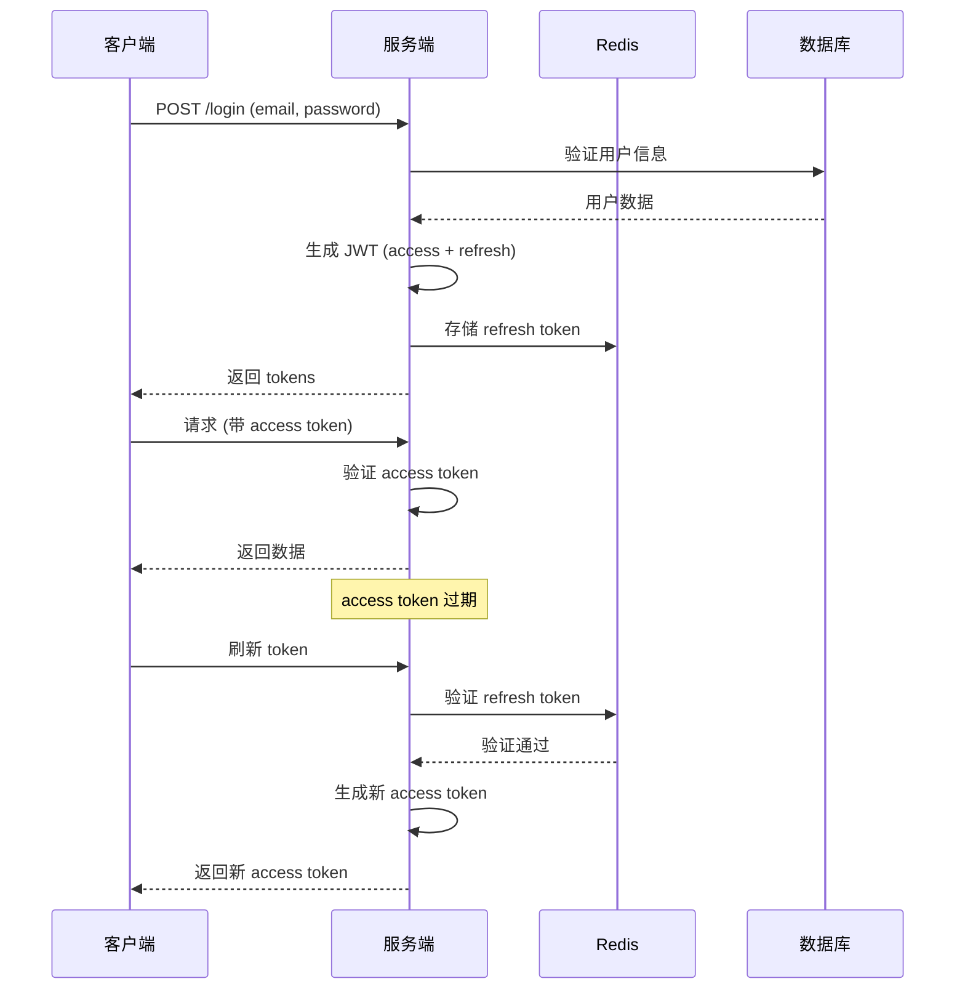
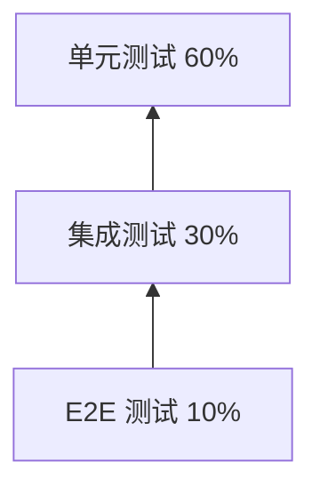
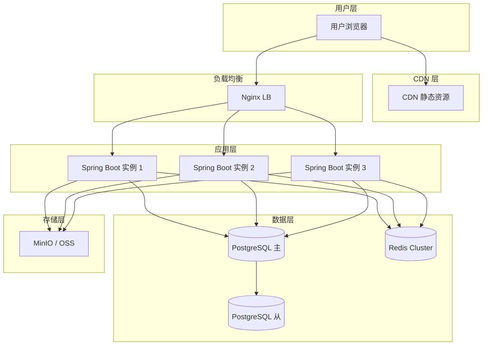

# ProjectHub 后端架构设计文档

| 文档版本 | 修改日期   | 修改人 | 修改内容   |
| -------- | ---------- | ------ | ---------- |
| v1.0     | 2026-03-11 | 架构组 | 初始版本   |

---

## 1. 技术选型

### 1.1 核心技术栈

| 技术类别 | 选型 | 版本 | 选型理由 |
| -------- | ---- | ---- | -------- |
| **JDK** | OpenJDK | 21 (LTS) | 长期支持版本、虚拟线程、模式匹配、性能优异 |
| **框架** | Spring Boot | 3.2.x | 企业级框架、生态完善、自动配置、活跃社区 |
| **构建工具** | Maven | 3.9+ | 依赖管理成熟、插件生态丰富、团队熟悉 |
| **数据库** | PostgreSQL | 15.x | 开源最强关系库、JSON 支持、扩展性强、GIS 能力 |
| **ORM** | Spring Data JPA + MyBatis Plus | 最新 | JPA 处理常规 CRUD，MyBatis 处理复杂查询 |
| **缓存** | Redis | 7.x | 高性能、数据结构丰富、Pub/Sub、持久化 |
| **连接池** | HikariCP | 5.x | 最快 JDBC 连接池、Spring Boot 默认 |
| **认证** | Spring Security + JWT | 最新 | 企业级安全、灵活、生态完善 |
| **API 文档** | SpringDoc OpenAPI | 2.x | OpenAPI 3.0 规范、自动生成、UI 美观 |
| **日志** | Logback + SLF4J | 最新 | Spring Boot 默认、性能好、灵活 |
| **JSON** | Jackson | 2.x | Spring Boot 默认、性能优异 |
| **校验** | Hibernate Validator | 8.x | Bean Validation 2.0 实现 |
| **映射** | MapStruct | 1.5.x | 编译时代码生成、类型安全、高性能 |
| **测试** | JUnit 5 + MockMvc + Testcontainers | 最新 | 单元测试、集成测试、容器化测试 |

### 1.2 中间件选型

| 中间件 | 选型 | 版本 | 选型理由 | 使用场景 |
| ------ | ---- | ---- | -------- | -------- |
| **消息队列** | Redis Streams | 7.x | 轻量、无需额外组件 | 异步通知、任务队列 |
| **搜索引擎** | PostgreSQL FTS | 15.x | 内置全文搜索、简单场景够用 | 项目/任务搜索 |
| **对象存储** | MinIO / 本地存储 | 最新 | 本地开发用 MinIO，生产用云存储 | 头像、附件存储 |

### 1.3 运维工具链

| 工具 | 选型 | 说明 |
| ---- | ---- | ---- |
| **容器化** | Docker + Docker Compose | 本地开发和部署 |
| **CI/CD** | GitHub Actions / Jenkins | 持续集成和部署 |
| **监控** | Prometheus + Grafana | 指标监控和可视化 |
| **链路追踪** | SkyWalking | 分布式链路追踪 |
| **日志收集** | ELK Stack | 日志集中管理和分析 |

---

## 2. 系统架构设计

### 2.1 整体架构图



### 2.2 分层架构图



### 2.3 DDD 领域驱动设计



---

## 3. 项目目录结构

```
projecthub-backend/
├── .mvn/                           # Maven 配置
├── .idea/                          # IDEA 配置
├── src/
│   ├── main/
│   │   ├── java/
│   │   │   └── com/
│   │   │       └── projecthub/
│   │   │           ├── ProjectHubApplication.java    # 启动类
│   │   │           │
│   │   │           ├── common/                       # 公共模块
│   │   │           │   ├── config/                   # 配置类
│   │   │           │   │   ├── SecurityConfig.java
│   │   │           │   │   ├── RedisConfig.java
│   │   │           │   │   ├── SwaggerConfig.java
│   │   │           │   │   ├── CorsConfig.java
│   │   │           │   │   ├── AsyncConfig.java
│   │   │           │   │   └── WebMvcConfig.java
│   │   │           │   │
│   │   │           │   ├── constant/                 # 常量定义
│   │   │           │   │   ├── ErrorCode.java
│   │   │           │   │   ├── UserStatus.java
│   │   │           │   │   ├── ProjectStatus.java
│   │   │           │   │   ├── TaskStatus.java
│   │   │           │   │   ├── IssueStatus.java
│   │   │           │   │   └── RoleType.java
│   │   │           │   │
│   │   │           │   ├── exception/                # 异常处理
│   │   │           │   │   ├── BusinessException.java
│   │   │           │   │   ├── ValidationException.java
│   │   │           │   │   ├── AuthenticationException.java
│   │   │           │   │   ├── AuthorizationException.java
│   │   │           │   │   └── GlobalExceptionHandler.java
│   │   │           │   │
│   │   │           │   ├── response/                 # 统一响应
│   │   │           │   │   ├── Result.java
│   │   │           │   │   ├── PageResult.java
│   │   │           │   │   └── PageInfo.java
│   │   │           │   │
│   │   │           │   ├── util/                     # 工具类
│   │   │           │   │   ├── JwtUtil.java
│   │   │           │   │   ├── PasswordUtil.java
│   │   │           │   │   ├── BeanCopyUtil.java
│   │   │           │   │   ├── DateUtil.java
│   │   │           │   │   └── FileUtil.java
│   │   │           │   │
│   │   │           │   └── aspect/                   # AOP 切面
│   │   │           │       ├── LogAspect.java
│   │   │           │       ├── PermissionAspect.java
│   │   │           │       └── RateLimitAspect.java
│   │   │           │
│   │   │           ├── module/                       # 业务模块
│   │   │           │   │
│   │   │           │   ├── auth/                     # 认证模块
│   │   │           │   │   ├── controller/
│   │   │           │   │   │   └── AuthController.java
│   │   │           │   │   ├── service/
│   │   │           │   │   │   ├── AuthService.java
│   │   │           │   │   │   └── impl/
│   │   │           │   │   │       └── AuthServiceImpl.java
│   │   │           │   │   ├── dto/
│   │   │           │   │   │   ├── LoginRequest.java
│   │   │           │   │   │   ├── RegisterRequest.java
│   │   │           │   │   │   ├── JwtResponse.java
│   │   │           │   │   │   └── RefreshTokenRequest.java
│   │   │           │   │   └── mapper/
│   │   │           │   │       └── AuthMapper.java
│   │   │           │   │
│   │   │           │   ├── user/                     # 用户模块
│   │   │           │   │   ├── controller/
│   │   │           │   │   │   └── UserController.java
│   │   │           │   │   ├── service/
│   │   │           │   │   │   ├── UserService.java
│   │   │           │   │   │   └── impl/
│   │   │           │   │   │       └── UserServiceImpl.java
│   │   │           │   │   ├── domain/
│   │   │           │   │   │   ├── User.java
│   │   │           │   │   │   └── Role.java
│   │   │           │   │   ├── repository/
│   │   │           │   │   │   ├── UserRepository.java
│   │   │           │   │   │   └── RoleRepository.java
│   │   │           │   │   ├── dto/
│   │   │           │   │   │   ├── UserVO.java
│   │   │           │   │   │   ├── CreateUserDTO.java
│   │   │           │   │   │   └── UpdateUserDTO.java
│   │   │           │   │   └── mapper/
│   │   │           │   │       └── UserMapper.java
│   │   │           │   │
│   │   │           │   ├── project/                  # 项目模块
│   │   │           │   │   ├── controller/
│   │   │           │   │   │   └── ProjectController.java
│   │   │           │   │   ├── service/
│   │   │           │   │   │   ├── ProjectService.java
│   │   │           │   │   │   └── impl/
│   │   │           │   │   │       └── ProjectServiceImpl.java
│   │   │           │   │   ├── domain/
│   │   │           │   │   │   ├── Project.java
│   │   │           │   │   │   └── ProjectMember.java
│   │   │           │   │   ├── repository/
│   │   │           │   │   │   ├── ProjectRepository.java
│   │   │           │   │   │   └── ProjectMemberRepository.java
│   │   │           │   │   ├── dto/
│   │   │           │   │   │   ├── ProjectVO.java
│   │   │           │   │   │   ├── CreateProjectDTO.java
│   │   │           │   │   │   ├── UpdateProjectDTO.java
│   │   │           │   │   │   └── ProjectMemberDTO.java
│   │   │           │   │   └── mapper/
│   │   │           │   │       └── ProjectMapper.java
│   │   │           │   │
│   │   │           │   ├── task/                     # 任务模块
│   │   │           │   │   ├── controller/
│   │   │           │   │   │   └── TaskController.java
│   │   │           │   │   ├── service/
│   │   │           │   │   │   ├── TaskService.java
│   │   │           │   │   │   └── impl/
│   │   │           │   │   │       └── TaskServiceImpl.java
│   │   │           │   │   ├── domain/
│   │   │           │   │   │   ├── Task.java
│   │   │           │   │   │   ├── SubTask.java
│   │   │           │   │   │   └── TaskComment.java
│   │   │           │   │   ├── repository/
│   │   │           │   │   │   ├── TaskRepository.java
│   │   │           │   │   │   ├── SubTaskRepository.java
│   │   │           │   │   │   └── TaskCommentRepository.java
│   │   │           │   │   ├── dto/
│   │   │           │   │   │   ├── TaskVO.java
│   │   │           │   │   │   ├── CreateTaskDTO.java
│   │   │           │   │   │   ├── UpdateTaskDTO.java
│   │   │           │   │   │   ├── MoveTaskDTO.java
│   │   │           │   │   │   └── TaskCommentDTO.java
│   │   │           │   │   └── mapper/
│   │   │           │   │       └── TaskMapper.java
│   │   │           │   │
│   │   │           │   ├── story/                    # 用户故事模块
│   │   │           │   │   ├── controller/
│   │   │           │   │   │   └── StoryController.java
│   │   │           │   │   ├── service/
│   │   │           │   │   │   ├── StoryService.java
│   │   │           │   │   │   └── impl/
│   │   │           │   │   │       └── StoryServiceImpl.java
│   │   │           │   │   ├── domain/
│   │   │           │   │   │   ├── Epic.java
│   │   │           │   │   │   └── UserStory.java
│   │   │           │   │   ├── repository/
│   │   │           │   │   │   ├── EpicRepository.java
│   │   │           │   │   │   └── UserStoryRepository.java
│   │   │           │   │   ├── dto/
│   │   │           │   │   │   ├── StoryVO.java
│   │   │           │   │   │   └── CreateStoryDTO.java
│   │   │           │   │   └── mapper/
│   │   │           │   │       └── StoryMapper.java
│   │   │           │   │
│   │   │           │   ├── issue/                    # 问题追踪模块
│   │   │           │   │   ├── controller/
│   │   │           │   │   │   └── IssueController.java
│   │   │           │   │   ├── service/
│   │   │           │   │   │   ├── IssueService.java
│   │   │           │   │   │   └── impl/
│   │   │           │   │   │       └── IssueServiceImpl.java
│   │   │           │   │   ├── domain/
│   │   │           │   │   │   └── Issue.java
│   │   │           │   │   ├── repository/
│   │   │           │   │   │   └── IssueRepository.java
│   │   │           │   │   ├── dto/
│   │   │           │   │   │   ├── IssueVO.java
│   │   │           │   │   │   └── CreateIssueDTO.java
│   │   │           │   │   └── mapper/
│   │   │           │   │       └── IssueMapper.java
│   │   │           │   │
│   │   │           │   ├── wiki/                     # Wiki 模块
│   │   │           │   │   ├── controller/
│   │   │           │   │   │   └── WikiController.java
│   │   │           │   │   ├── service/
│   │   │           │   │   │   ├── WikiService.java
│   │   │           │   │   │   └── impl/
│   │   │           │   │   │       └── WikiServiceImpl.java
│   │   │           │   │   ├── domain/
│   │   │           │   │   │   └── WikiDocument.java
│   │   │           │   │   ├── repository/
│   │   │           │   │   │   └── WikiRepository.java
│   │   │           │   │   ├── dto/
│   │   │           │   │   │   ├── WikiVO.java
│   │   │           │   │   │   └── CreateWikiDTO.java
│   │   │           │   │   └── mapper/
│   │   │           │   │       └── WikiMapper.java
│   │   │           │   │
│   │   │           │   ├── report/                   # 报表模块
│   │   │           │   │   ├── controller/
│   │   │           │   │   │   └── ReportController.java
│   │   │           │   │   ├── service/
│   │   │           │   │   │   ├── ReportService.java
│   │   │           │   │   │   └── impl/
│   │   │           │   │   │       └── ReportServiceImpl.java
│   │   │           │   │   └── dto/
│   │   │           │   │       ├── BurndownChartVO.java
│   │   │           │   │       ├── CumulativeFlowVO.java
│   │   │           │   │       └── VelocityChartVO.java
│   │   │           │   │
│   │   │           │   └── notification/             # 通知模块
│   │   │           │       ├── controller/
│   │   │           │       │   └── NotificationController.java
│   │   │           │       ├── service/
│   │   │           │       │   ├── NotificationService.java
│   │   │           │       │   └── impl/
│   │   │           │       │       └── NotificationServiceImpl.java
│   │   │           │       ├── domain/
│   │   │           │       │   └── Notification.java
│   │   │           │       ├── repository/
│   │   │           │       │   └── NotificationRepository.java
│   │   │           │       └── dto/
│   │   │           │           └── NotificationVO.java
│   │   │           │
│   │   │           ├── security/                     # 安全相关
│   │   │           │   ├── JwtAuthenticationFilter.java
│   │   │           │   ├── UserDetailsImpl.java
│   │   │           │   └── PermissionEvaluatorImpl.java
│   │   │           │
│   │   │           └── infrastructure/               # 基础设施
│   │   │               ├── cache/
│   │   │               │   └── CacheService.java
│   │   │               ├── storage/
│   │   │               │   └── StorageService.java
│   │   │               └── async/
│   │   │                   └── AsyncEventListener.java
│   │   │
│   │   └── resources/
│   │       ├── application.yml                       # 主配置文件
│   │       ├── application-dev.yml                   # 开发环境配置
│   │       ├── application-prod.yml                  # 生产环境配置
│   │       ├── application-test.yml                  # 测试环境配置
│   │       ├── mapper/                               # MyBatis Mapper XML
│   │       │   ├── ProjectMapper.xml
│   │       │   └── TaskMapper.xml
│   │       └── db/
│   │           └── migration/                        # Flyway 迁移脚本
│   │               └── V1__init_schema.sql
│   │
│   └── test/
│       ├── java/
│       │   └── com/
│       │       └── projecthub/
│       │           ├── ProjectHubApplicationTests.java
│       │           ├── common/
│       │           ├── module/
│       │           │   ├── auth/
│       │           │   ├── project/
│       │           │   └── task/
│       │           └── integration/
│       │
│       └── resources/
│           ├── application-test.yml
│           └── sql/
│               ├── cleanup.sql
│               └── seed-data.sql
│
├── docker/
│   ├── Dockerfile
│   ├── docker-compose.yml
│   └── docker-compose-dev.yml
│
├── .gitignore
├── .editorconfig
├── pom.xml
├── mvnw
├── mvnw.cmd
├── README.md
└── API.md                                  # API 使用说明
```

---

## 4. 数据模型设计

### 4.1 核心实体关系图 (ER Diagram)

详细 ER 图请参见 [er-diagram.md](./database/er-diagram.md)

### 4.2 实体设计说明

#### 用户实体 (User)

```java
@Entity
@Table(name = "sys_user")
@Data
@Builder
@NoArgsConstructor
@AllArgsConstructor
public class User {
    @Id
    @GeneratedValue(strategy = GenerationType.IDENTITY)
    private Long id;

    @Column(nullable = false, unique = true, length = 50)
    @NotBlank(message = "用户名不能为空")
    @Size(min = 2, max = 20, message = "用户名长度 2-20 字符")
    private String username;

    @Column(nullable = false, unique = true, length = 100)
    @NotBlank(message = "邮箱不能为空")
    @Email(message = "邮箱格式不正确")
    private String email;

    @Column(nullable = false, length = 255)
    @NotBlank(message = "密码不能为空")
    @Size(min = 8, max = 20, message = "密码长度 8-20 字符")
    private String password;

    @Column(length = 255)
    private String avatar;

    @Enumerated(EnumType.STRING)
    @Column(nullable = false, length = 20)
    @Builder.Default
    private UserStatus status = UserStatus.ACTIVE;

    @Column(name = "created_at", nullable = false, updatable = false)
    @CreationTimestamp
    private LocalDateTime createdAt;

    @Column(name = "updated_at")
    @UpdateTimestamp
    private LocalDateTime updatedAt;

    @Column(name = "deleted_at")
    private LocalDateTime deletedAt;

    @OneToMany(mappedBy = "user", cascade = CascadeType.ALL)
    private List<Role> roles;
}
```

#### 项目实体 (Project)

```java
@Entity
@Table(name = "project")
@Data
@Builder
@NoArgsConstructor
@AllArgsConstructor
public class Project {
    @Id
    @GeneratedValue(strategy = GenerationType.IDENTITY)
    private Long id;

    @Column(nullable = false, length = 100)
    @NotBlank(message = "项目名称不能为空")
    @Size(max = 100, message = "项目名称最多 100 字符")
    private String name;

    @Column(columnDefinition = "TEXT")
    private String description;

    @Column(name = "start_date", nullable = false)
    @NotNull(message = "开始日期不能为空")
    private LocalDate startDate;

    @Column(name = "end_date", nullable = false)
    @NotNull(message = "结束日期不能为空")
    private LocalDate endDate;

    @Enumerated(EnumType.STRING)
    @Column(nullable = false, length = 20)
    @Builder.Default
    private ProjectStatus status = ProjectStatus.ACTIVE;

    @Column(name = "owner_id", nullable = false)
    @NotNull(message = "项目负责人不能为空")
    private Long ownerId;

    @Column(name = "icon", length = 50)
    private String icon;

    @Column(name = "theme_color", length = 20)
    private String themeColor;

    @Column(name = "created_at", nullable = false, updatable = false)
    @CreationTimestamp
    private LocalDateTime createdAt;

    @Column(name = "updated_at")
    @UpdateTimestamp
    private LocalDateTime updatedAt;

    @Column(name = "deleted_at")
    private LocalDateTime deletedAt;

    @OneToMany(mappedBy = "project", cascade = CascadeType.ALL)
    private List<ProjectMember> members;

    @OneToMany(mappedBy = "project")
    private List<Task> tasks;
}
```

#### 任务实体 (Task)

```java
@Entity
@Table(name = "task")
@Data
@Builder
@NoArgsConstructor
@AllArgsConstructor
public class Task {
    @Id
    @GeneratedValue(strategy = GenerationType.IDENTITY)
    private Long id;

    @Column(nullable = false, length = 200)
    @NotBlank(message = "任务标题不能为空")
    @Size(max = 200, message = "任务标题最多 200 字符")
    private String title;

    @Column(columnDefinition = "TEXT")
    private String description;

    @Enumerated(EnumType.STRING)
    @Column(nullable = false, length = 20)
    @Builder.Default
    private TaskStatus status = TaskStatus.TODO;

    @Enumerated(EnumType.STRING)
    @Column(nullable = false, length = 20)
    @Builder.Default
    private Priority priority = Priority.MEDIUM;

    @Column(name = "assignee_id")
    private Long assigneeId;

    @Column(name = "creator_id", nullable = false)
    @NotNull(message = "任务创建人不能为空")
    private Long creatorId;

    @Column(name = "project_id", nullable = false)
    @NotNull(message = "所属项目不能为空")
    private Long projectId;

    @Column(name = "parent_id")
    private Long parentId;

    @Column(name = "due_date")
    private LocalDate dueDate;

    @Column(name = "story_points")
    @Min(0)
    private Integer storyPoints;

    @Column(name = "position", nullable = false)
    @Builder.Default
    private Integer position = 0;

    @Column(name = "created_at", nullable = false, updatable = false)
    @CreationTimestamp
    private LocalDateTime createdAt;

    @Column(name = "updated_at")
    @UpdateTimestamp
    private LocalDateTime updatedAt;

    @Column(name = "deleted_at")
    private LocalDateTime deletedAt;
}
```

#### 用户故事实体 (UserStory)

```java
@Entity
@Table(name = "user_story")
@Data
@Builder
@NoArgsConstructor
@AllArgsConstructor
public class UserStory {
    @Id
    @GeneratedValue(strategy = GenerationType.IDENTITY)
    private Long id;

    @Column(name = "epic_id")
    private Long epicId;

    @Column(name = "project_id", nullable = false)
    @NotNull(message = "所属项目不能为空")
    private Long projectId;

    @Column(nullable = false, length = 200)
    @NotBlank(message = "故事标题不能为空")
    private String title;

    @Column(columnDefinition = "TEXT")
    private String description;

    @Column(name = "acceptance_criteria", columnDefinition = "TEXT")
    private String acceptanceCriteria;

    @Enumerated(EnumType.STRING)
    @Column(nullable = false, length = 20)
    @Builder.Default
    private Priority priority = Priority.MEDIUM;

    @Column(name = "story_points")
    @Min(0)
    private Integer storyPoints;

    @Column(name = "assignee_id")
    private Long assigneeId;

    @Enumerated(EnumType.STRING)
    @Column(nullable = false, length = 20)
    @Builder.Default
    private TaskStatus status = TaskStatus.TODO;

    @Column(name = "created_at", nullable = false, updatable = false)
    @CreationTimestamp
    private LocalDateTime createdAt;

    @Column(name = "updated_at")
    @UpdateTimestamp
    private LocalDateTime updatedAt;
}
```

#### 问题实体 (Issue)

```java
@Entity
@Table(name = "issue")
@Data
@Builder
@NoArgsConstructor
@AllArgsConstructor
public class Issue {
    @Id
    @GeneratedValue(strategy = GenerationType.IDENTITY)
    private Long id;

    @Column(name = "project_id", nullable = false)
    @NotNull(message = "所属项目不能为空")
    private Long projectId;

    @Column(nullable = false, length = 200)
    @NotBlank(message = "问题标题不能为空")
    private String title;

    @Column(columnDefinition = "TEXT")
    private String description;

    @Enumerated(EnumType.STRING)
    @Column(nullable = false, length = 20)
    @Builder.Default
    private IssueType type = IssueType.BUG;

    @Enumerated(EnumType.STRING)
    @Column(nullable = false, length = 20)
    @Builder.Default
    private IssueSeverity severity = IssueSeverity.NORMAL;

    @Enumerated(EnumType.STRING)
    @Column(nullable = false, length = 20)
    @Builder.Default
    private IssueStatus status = IssueStatus.NEW;

    @Column(name = "assignee_id")
    private Long assigneeId;

    @Column(name = "reporter_id", nullable = false)
    @NotNull(message = "报告人不能为空")
    private Long reporterId;

    @Column(name = "found_date", nullable = false)
    @NotNull(message = "发现日期不能为空")
    private LocalDate foundDate;

    @Column(name = "resolved_date")
    private LocalDate resolvedDate;

    @Column(name = "created_at", nullable = false, updatable = false)
    @CreationTimestamp
    private LocalDateTime createdAt;

    @Column(name = "updated_at")
    @UpdateTimestamp
    private LocalDateTime updatedAt;
}
```

#### 评论实体 (Comment)

```java
@Entity
@Table(name = "comment")
@Data
@Builder
@NoArgsConstructor
@AllArgsConstructor
public class Comment {
    @Id
    @GeneratedValue(strategy = GenerationType.IDENTITY)
    private Long id;

    @Column(name = "task_id")
    private Long taskId;

    @Column(name = "issue_id")
    private Long issueId;

    @Column(name = "story_id")
    private Long storyId;

    @Column(name = "user_id", nullable = false)
    @NotNull(message = "评论人不能为空")
    private Long userId;

    @Column(nullable = false, columnDefinition = "TEXT")
    @NotBlank(message = "评论内容不能为空")
    private String content;

    @Column(name = "parent_id")
    private Long parentId;

    @Column(name = "created_at", nullable = false, updatable = false)
    @CreationTimestamp
    private LocalDateTime createdAt;

    @Column(name = "updated_at")
    @UpdateTimestamp
    private LocalDateTime updatedAt;

    @Column(name = "deleted_at")
    private LocalDateTime deletedAt;
}
```

#### 通知实体 (Notification)

```java
@Entity
@Table(name = "notification")
@Data
@Builder
@NoArgsConstructor
@AllArgsConstructor
public class Notification {
    @Id
    @GeneratedValue(strategy = GenerationType.IDENTITY)
    private Long id;

    @Column(name = "user_id", nullable = false)
    @NotNull(message = "接收用户不能为空")
    private Long userId;

    @Column(nullable = false, length = 200)
    @NotBlank(message = "通知标题不能为空")
    private String title;

    @Column(columnDefinition = "TEXT")
    private String content;

    @Enumerated(EnumType.STRING)
    @Column(nullable = false, length = 20)
    @Builder.Default
    private NotificationType type = NotificationType.INFO;

    @Column(nullable = false)
    @Builder.Default
    private Boolean isRead = false;

    @Column(name = "related_id")
    private Long relatedId;

    @Column(name = "related_type", length = 50)
    private String relatedType;

    @Column(name = "created_at", nullable = false, updatable = false)
    @CreationTimestamp
    private LocalDateTime createdAt;
}
```

---

## 5. API 设计

### 5.1 API 设计原则

| 原则 | 说明 |
| ---- | ---- |
| **RESTful 风格** | 使用资源命名、HTTP 动词、状态码 |
| **统一响应格式** | 所有接口返回统一的 Result<T> 格式 |
| **版本管理** | URL 前缀包含版本号 `/api/v1/` |
| **分页统一** | 列表接口统一分页参数和响应格式 |
| **错误码规范** | 使用数字错误码，按模块分类 |
| **幂等性** | 写操作支持幂等，防止重复提交 |
| **限流** | 关键接口实现限流，防止滥用 |

### 5.2 统一响应格式

```java
@Data
@Builder
@AllArgsConstructor
@NoArgsConstructor
public class Result<T> {
    private Integer code;
    private String message;
    private T data;
    private Long timestamp;

    public static <T> Result<T> success() {
        return Result.<T>builder()
                .code(200)
                .message("success")
                .timestamp(System.currentTimeMillis())
                .build();
    }

    public static <T> Result<T> success(T data) {
        return Result.<T>builder()
                .code(200)
                .message("success")
                .data(data)
                .timestamp(System.currentTimeMillis())
                .build();
    }

    public static <T> Result<T> error(String message) {
        return Result.<T>builder()
                .code(500)
                .message(message)
                .timestamp(System.currentTimeMillis())
                .build();
    }

    public static <T> Result<T> error(Integer code, String message) {
        return Result.<T>builder()
                .code(code)
                .message(message)
                .timestamp(System.currentTimeMillis())
                .build();
    }
}
```

### 5.3 错误码设计

```java
public enum ErrorCode {
    // 通用错误 1000-1999
    SUCCESS(200, "成功"),
    BAD_REQUEST(400, "请求参数错误"),
    UNAUTHORIZED(401, "未授权"),
    FORBIDDEN(403, "禁止访问"),
    NOT_FOUND(404, "资源不存在"),
    INTERNAL_ERROR(500, "服务器内部错误"),

    // 认证模块 2000-2999
    LOGIN_FAILED(2001, "登录失败"),
    TOKEN_EXPIRED(2002, "Token 已过期"),
    TOKEN_INVALID(2003, "Token 无效"),
    USER_DISABLED(2004, "用户已被禁用"),

    // 用户模块 3000-3999
    USER_NOT_FOUND(3001, "用户不存在"),
    USER_ALREADY_EXISTS(3002, "用户已存在"),
    EMAIL_ALREADY_EXISTS(3003, "邮箱已被注册"),
    USERNAME_ALREADY_EXISTS(3004, "用户名已存在"),
    PASSWORD_ERROR(3005, "密码错误"),

    // 项目模块 4000-4999
    PROJECT_NOT_FOUND(4001, "项目不存在"),
    PROJECT_PERMISSION_DENIED(4002, "无项目访问权限"),
    PROJECT_MEMBER_EXISTS(4003, "成员已存在"),
    PROJECT_NOT_ALLOWED_DELETE(4004, "不允许删除"),

    // 任务模块 5000-5999
    TASK_NOT_FOUND(5001, "任务不存在"),
    TASK_PERMISSION_DENIED(5002, "无任务访问权限"),
    TASK_STATUS_INVALID(5003, "任务状态不合法"),

    // 其他模块...
    ;

    private final Integer code;
    private final String message;
}
```

### 5.4 API 接口清单

完整 API 文档请参见 [openapi.yaml](./api/openapi.yaml)

| 模块 | 接口 | 方法 | 路径 | 说明 |
| ---- | ---- | ---- | ---- | ---- |
| **认证** | 登录 | POST | /api/v1/auth/login | 用户登录 |
| | 注册 | POST | /api/v1/auth/register | 用户注册 |
| | 登出 | POST | /api/v1/auth/logout | 用户登出 |
| | 刷新 Token | POST | /api/v1/auth/refresh | 刷新访问 Token |
| | 密码重置 | POST | /api/v1/auth/password/reset | 发送重置邮件 |
| **用户** | 获取资料 | GET | /api/v1/user/profile | 获取当前用户资料 |
| | 更新资料 | PUT | /api/v1/user/profile | 更新用户资料 |
| | 更新头像 | POST | /api/v1/user/avatar | 上传用户头像 |
| **项目** | 列表 | GET | /api/v1/projects | 获取项目列表 |
| | 详情 | GET | /api/v1/projects/{id} | 获取项目详情 |
| | 创建 | POST | /api/v1/projects | 创建项目 |
| | 更新 | PUT | /api/v1/projects/{id} | 更新项目 |
| | 删除 | DELETE | /api/v1/projects/{id} | 删除项目 |
| | 成员列表 | GET | /api/v1/projects/{id}/members | 获取项目成员 |
| | 添加成员 | POST | /api/v1/projects/{id}/members | 添加项目成员 |
| | 移除成员 | DELETE | /api/v1/projects/{id}/members/{userId} | 移除成员 |
| **任务** | 列表 | GET | /api/v1/tasks | 获取任务列表 |
| | 详情 | GET | /api/v1/tasks/{id} | 获取任务详情 |
| | 创建 | POST | /api/v1/tasks | 创建任务 |
| | 更新 | PUT | /api/v1/tasks/{id} | 更新任务 |
| | 删除 | DELETE | /api/v1/tasks/{id} | 删除任务 |
| | 移动 | POST | /api/v1/tasks/{id}/move | 移动任务状态 |
| | 评论列表 | GET | /api/v1/tasks/{id}/comments | 获取任务评论 |
| | 添加评论 | POST | /api/v1/tasks/{id}/comments | 添加评论 |
| **用户故事** | 列表 | GET | /api/v1/projects/{id}/stories | 获取故事列表 |
| | 详情 | GET | /api/v1/projects/{id}/stories/{storyId} | 获取故事详情 |
| | 创建 | POST | /api/v1/projects/{id}/stories | 创建故事 |
| | 更新 | PUT | /api/v1/projects/{id}/stories/{storyId} | 更新故事 |
| | 删除 | DELETE | /api/v1/projects/{id}/stories/{storyId} | 删除故事 |
| **问题** | 列表 | GET | /api/v1/projects/{id}/issues | 获取问题列表 |
| | 详情 | GET | /api/v1/projects/{id}/issues/{issueId} | 获取问题详情 |
| | 创建 | POST | /api/v1/projects/{id}/issues | 创建问题 |
| | 更新 | PUT | /api/v1/projects/{id}/issues/{issueId} | 更新问题 |
| | 删除 | DELETE | /api/v1/projects/{id}/issues/{issueId} | 删除问题 |
| **Wiki** | 列表 | GET | /api/v1/projects/{id}/wiki | 获取文档列表 |
| | 详情 | GET | /api/v1/projects/{id}/wiki/{docId} | 获取文档详情 |
| | 创建 | POST | /api/v1/projects/{id}/wiki | 创建文档 |
| | 更新 | PUT | /api/v1/projects/{id}/wiki/{docId} | 更新文档 |
| | 删除 | DELETE | /api/v1/projects/{id}/wiki/{docId} | 删除文档 |
| **报表** | 燃尽图 | GET | /api/v1/projects/{id}/reports/burndown | 获取燃尽图数据 |
| | 累积流 | GET | /api/v1/projects/{id}/reports/cumulative-flow | 获取累积流数据 |
| | 速度图 | GET | /api/v1/projects/{id}/reports/velocity | 获取速度图数据 |
| **通知** | 列表 | GET | /api/v1/notifications | 获取通知列表 |
| | 未读数 | GET | /api/v1/notifications/unread-count | 获取未读消息数 |
| | 标记已读 | POST | /api/v1/notifications/{id}/read | 标记为已读 |
| | 全部已读 | POST | /api/v1/notifications/read-all | 全部标记已读 |

---

## 6. 安全设计

### 6.1 认证流程



### 6.2 JWT Token 设计

```java
@Data
@Builder
public class JwtToken {
    private String accessToken;
    private String refreshToken;
    private Long expiresIn;        // access token 过期时间 (秒)
    private Long refreshExpiresIn; // refresh token 过期时间 (秒)
}

// Token 配置
@Configuration
public class JwtConfig {
    @Value("${jwt.secret}")
    private String secret;

    @Value("${jwt.expiration}")
    private Long expiration; // 2 小时

    @Value("${jwt.refresh-expiration}")
    private Long refreshExpiration; // 7 天
}
```

### 6.3 权限设计

```java
// 权限枚举
public enum Permission {
    // 项目权限
    PROJECT_VIEW,
    PROJECT_CREATE,
    PROJECT_EDIT,
    PROJECT_DELETE,
    PROJECT_MEMBER_MANAGE,

    // 任务权限
    TASK_VIEW,
    TASK_CREATE,
    TASK_EDIT,
    TASK_DELETE,
    TASK_ASSIGN,
    TASK_MOVE,

    // 其他权限
    WIKI_VIEW,
    WIKI_EDIT,
    REPORT_VIEW,
    ADMIN_ACCESS,
}

// 权限校验切面
@Aspect
@Component
public class PermissionAspect {
    @Around("@annotation(permission)")
    public Object checkPermission(ProceedingJoinPoint pjp, RequirePermission permission) throws Throwable {
        // 获取当前用户
        Long userId = SecurityUtil.getCurrentUserId();

        // 获取项目 ID (从参数或路径)
        Long projectId = extractProjectId(pjp.getArgs());

        // 校验权限
        if (!permissionService.hasPermission(userId, projectId, permission.value())) {
            throw new AuthorizationException("权限不足");
        }

        return pjp.proceed();
    }
}

// 使用示例
@RestController
@RequestMapping("/api/v1/projects/{projectId}/tasks")
public class TaskController {

    @RequirePermission(Permission.TASK_CREATE)
    @PostMapping
    public Result<TaskVO> createTask(@PathVariable Long projectId,
                                      @RequestBody CreateTaskDTO dto) {
        // ...
    }
}
```

---

## 7. 缓存设计

### 7.1 缓存策略

| 数据类型 | 缓存策略 | 过期时间 | 说明 |
| -------- | -------- | -------- | ---- |
| 用户信息 | Cache-Aside | 30 分钟 | 用户资料、角色权限 |
| 项目信息 | Cache-Aside | 10 分钟 | 项目详情、成员列表 |
| 任务列表 | Cache-Aside | 5 分钟 | 任务列表按状态缓存 |
| 统计数据 | Cache-Aside | 1 小时 | 报表统计数据 |
| Session | Redis Hash | 2 小时 | 用户会话信息 |

### 7.2 缓存 Key 设计

```java
public class CacheKeys {
    private static final String PREFIX = "projecthub:";

    // 用户相关
    public static String userKey(Long userId) {
        return PREFIX + "user:" + userId;
    }

    public static String userPermissionKey(Long userId, Long projectId) {
        return PREFIX + "user:permission:" + userId + ":" + projectId;
    }

    // 项目相关
    public static String projectKey(Long projectId) {
        return PREFIX + "project:" + projectId;
    }

    public static String projectMembersKey(Long projectId) {
        return PREFIX + "project:members:" + projectId;
    }

    // 任务相关
    public static String taskListKey(Long projectId, String status) {
        return PREFIX + "task:list:" + projectId + ":" + status;
    }

    // 统计相关
    public static String burndownKey(Long projectId) {
        return PREFIX + "report:burndown:" + projectId;
    }

    // Token 相关
    public static String refreshTokenKey(String token) {
        return PREFIX + "token:refresh:" + token;
    }
}
```

---

## 8. 性能优化策略

### 8.1 数据库优化

| 优化项 | 方案 | 说明 |
| ------ | ---- | ---- |
| **索引设计** | 对查询字段建立索引 | user_id, project_id, status, created_at |
| **分页优化** | 使用游标分页 | 避免深度分页性能问题 |
| **读写分离** | 主从复制 | 报表等读操作走从库 |
| **批量操作** | 批量插入/更新 | 减少数据库交互次数 |
| **SQL 优化** | 避免 N+1 查询 | 使用 JOIN FETCH |

### 8.2 异步处理

```java
// 异步事件处理
@Component
public class AsyncEventListener {

    @Async
    @EventListener
    public void handleTaskCreatedEvent(TaskCreatedEvent event) {
        // 发送通知
        notificationService.sendTaskNotification(event);
    }

    @Async
    @EventListener
    public void handleProjectMemberAddedEvent(ProjectMemberAddedEvent event) {
        // 发送欢迎邮件
        emailService.sendWelcomeEmail(event);
    }
}

// 异步配置
@Configuration
@EnableAsync
public class AsyncConfig {
    @Bean(name = "taskExecutor")
    public Executor taskExecutor() {
        ThreadPoolTaskExecutor executor = new ThreadPoolTaskExecutor();
        executor.setCorePoolSize(10);
        executor.setMaxPoolSize(20);
        executor.setQueueCapacity(100);
        executor.setThreadNamePrefix("async-");
        executor.initialize();
        return executor;
    }
}
```

---

## 9. 测试策略

### 9.1 测试金字塔



### 9.2 测试范围

| 测试类型 | 测试对象 | 工具 | 覆盖率要求 |
| -------- | -------- | ---- | ---------- |
| 单元测试 | Service、Repository | JUnit 5 + Mockito | ≥80% |
| 集成测试 | Controller、Service 集成 | SpringBootTest + Testcontainers | 关键路径 |
| E2E 测试 | 完整业务流程 | Postman/Newman | 核心流程 |

### 9.3 测试用例示例

```java
@SpringBootTest
@AutoConfigureMockMvc
class TaskControllerTest {

    @Autowired
    private MockMvc mockMvc;

    @Autowired
    private ObjectMapper objectMapper;

    @Test
    @WithMockUser(username = "testuser", roles = "MEMBER")
    void shouldCreateTask() throws Exception {
        // Given
        CreateTaskDTO dto = CreateTaskDTO.builder()
                .projectId(1L)
                .title("测试任务")
                .priority(Priority.HIGH)
                .build();

        // When & Then
        mockMvc.perform(post("/api/v1/tasks")
                        .contentType(MediaType.APPLICATION_JSON)
                        .content(objectMapper.writeValueAsString(dto)))
                .andExpect(status().isOk())
                .andExpect(jsonPath("$.code").value(200))
                .andExpect(jsonPath("$.data.title").value("测试任务"));
    }
}
```

---

## 10. 部署架构

### 10.1 部署架构图



### 10.2 Docker Compose 配置

```yaml
version: '3.8'
services:
  app:
    build: .
    ports:
      - "8080:8080"
    environment:
      - SPRING_PROFILES_ACTIVE=prod
      - DB_HOST=postgres
      - REDIS_HOST=redis
    depends_on:
      - postgres
      - redis
    networks:
      - projecthub

  postgres:
    image: postgres:15-alpine
    environment:
      - POSTGRES_DB=projecthub
      - POSTGRES_USER=projecthub
      - POSTGRES_PASSWORD=secret
    volumes:
      - postgres_data:/var/lib/postgresql/data
    networks:
      - projecthub

  redis:
    image: redis:7-alpine
    command: redis-server --appendonly yes
    volumes:
      - redis_data:/data
    networks:
      - projecthub

  minio:
    image: minio/minio
    ports:
      - "9000:9000"
      - "9001:9001"
    environment:
      - MINIO_ROOT_USER=minioadmin
      - MINIO_ROOT_PASSWORD=minioadmin
    command: server /data --console-address ":9001"
    volumes:
      - minio_data:/data
    networks:
      - projecthub

volumes:
  postgres_data:
  redis_data:
  minio_data:

networks:
  projecthub:
    driver: bridge
```

---

## 11. 监控和日志方案

### 11.1 监控指标

| 指标类别 | 监控项 | 告警阈值 |
| -------- | ------ | -------- |
| **应用层** | JVM 堆内存 | >80% |
| | GC 时间 | >1s |
| | 线程池使用率 | >80% |
| | 接口响应时间 P95 | >500ms |
| | 接口错误率 | >1% |
| **数据库** | 连接池使用率 | >80% |
| | 慢查询数量 | >10/min |
| | 锁等待时间 | >1s |
| **缓存** | Redis 内存使用 | >80% |
| | 缓存命中率 | <70% |
| | 连接数 | >100 |

### 11.2 日志规范

```java
@Slf4j
@Service
public class TaskServiceImpl implements TaskService {

    @Override
    public TaskVO createTask(CreateTaskDTO dto) {
        Long userId = SecurityUtil.getCurrentUserId();
        log.info("创建任务，userId={}, dto={}", userId, dto);

        try {
            // 业务逻辑
            Task task = convertToEntity(dto);
            task.setCreatorId(userId);
            taskRepository.save(task);

            log.info("创建任务成功，taskId={}", task.getId());
            return convertToVO(task);
        } catch (Exception e) {
            log.error("创建任务失败，userId={}, dto={}", userId, dto, e);
            throw new BusinessException("创建任务失败");
        }
    }
}
```

---

## 12. 验收标准

### 12.1 功能验收

| 序号 | 验收项 | 通过标准 |
| ---- | ------ | -------- |
| 1 | 用户注册登录 | 可成功注册、登录、退出，Token 机制正常 |
| 2 | 项目 CRUD | 可创建、查看、编辑、删除项目，权限校验正常 |
| 3 | 任务管理 | 可创建、分配、更新、删除任务，状态流转正常 |
| 4 | 看板功能 | 任务状态移动正常，排序正确 |
| 5 | 权限控制 | 无权限访问返回 403，接口级权限校验正常 |
| 6 | 数据报表 | 燃尽图、累积流、速度图数据正确 |

### 12.2 性能验收

| 序号 | 验收项 | 通过标准 |
| ---- | ------ | -------- |
| 1 | 接口响应 | 95% 请求<500ms，P99<1s |
| 2 | 并发能力 | 支持 100 并发无错误 |
| 3 | 数据库连接 | 连接池无泄漏，峰值使用<80% |
| 4 | 缓存命中 | 热点数据缓存命中率>80% |

### 12.3 安全验收

| 序号 | 验收项 | 通过标准 |
| ---- | ------ | -------- |
| 1 | 密码加密 | 密码使用 bcrypt 加密存储 |
| 2 | JWT 认证 | Token 可正常签发、验证、刷新 |
| 3 | SQL 注入 | 无法通过注入获取数据 |
| 4 | XSS 防护 | 输入被正确转义 |
| 5 | CSRF 防护 | 跨域请求被正确拦截 |
| 6 | 权限校验 | 接口级权限校验正常 |

### 12.4 代码质量验收

| 序号 | 验收项 | 通过标准 |
| ---- | ------ | -------- |
| 1 | 单元测试 | 覆盖率≥80%，全部通过 |
| 2 | 集成测试 | 关键路径测试通过 |
| 3 | 代码规范 | CheckStyle/SpotBugs 无严重问题 |
| 4 | API 文档 | OpenAPI 文档完整可访问 |

---

## 附录

### A. 开发环境配置

```bash
# 必需工具
- JDK 21+
- Maven 3.9+
- PostgreSQL 15+
- Redis 7+
- Docker Desktop
- IDEA 2023.x
```

### B. 快速开始

```bash
# 克隆项目
git clone https://github.com/xxx/projecthub-backend.git

# 启动依赖服务
docker-compose up -d postgres redis minio

# 修改配置文件
cp src/main/resources/application-dev.yml.example src/main/resources/application-dev.yml

# 运行应用
mvn spring-boot:run

# 访问 Swagger UI
http://localhost:8080/swagger-ui.html
```

### C. 常用命令

```bash
# 打包
mvn clean package -DskipTests

# 运行测试
mvn test

# 查看测试覆盖率
mvn clean test jacoco:report

# 代码检查
mvn checkstyle:check
```

---

**文档版本**: v1.0
**最后更新**: 2026-03-11
**审核状态**: 待审核
