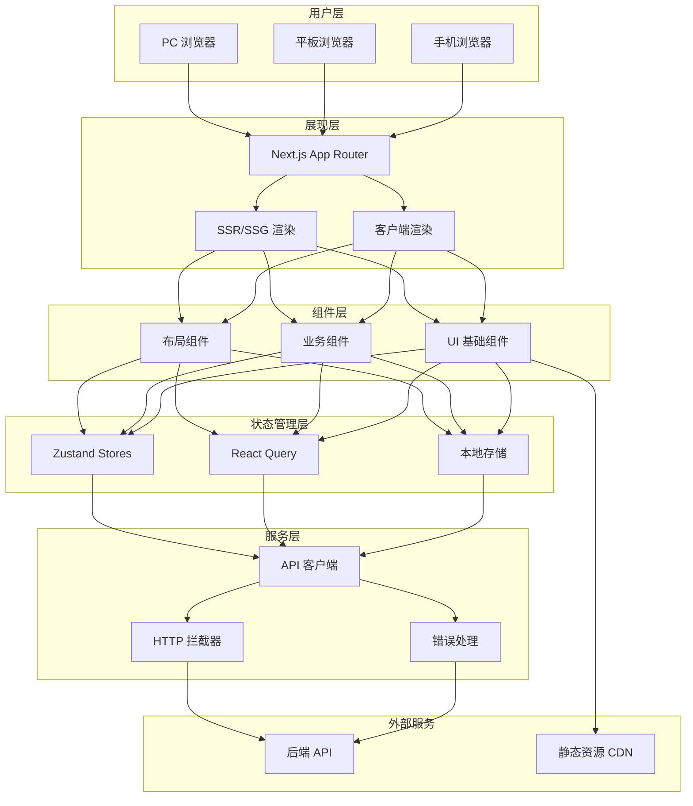
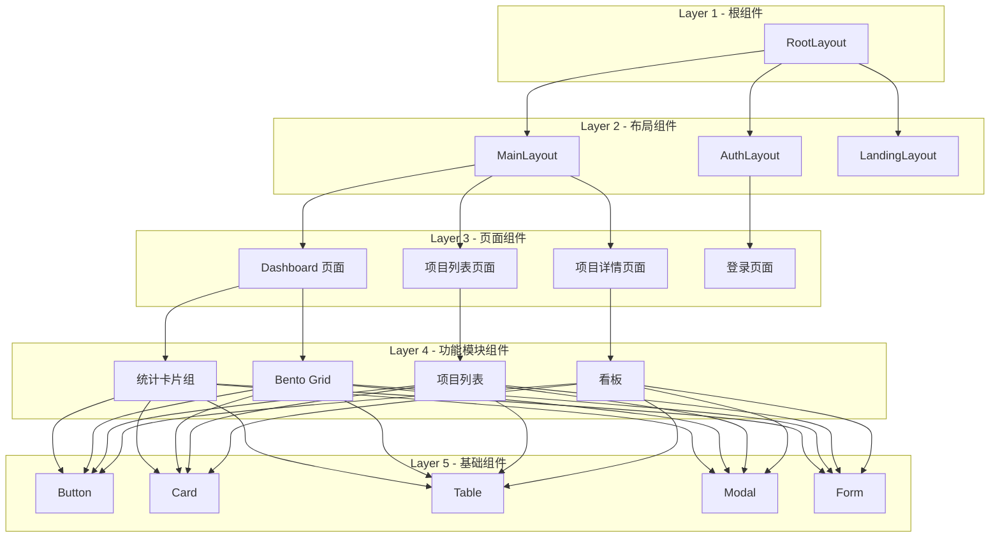
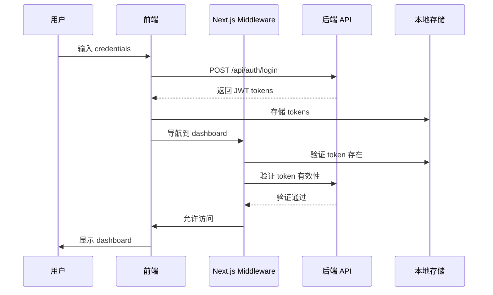
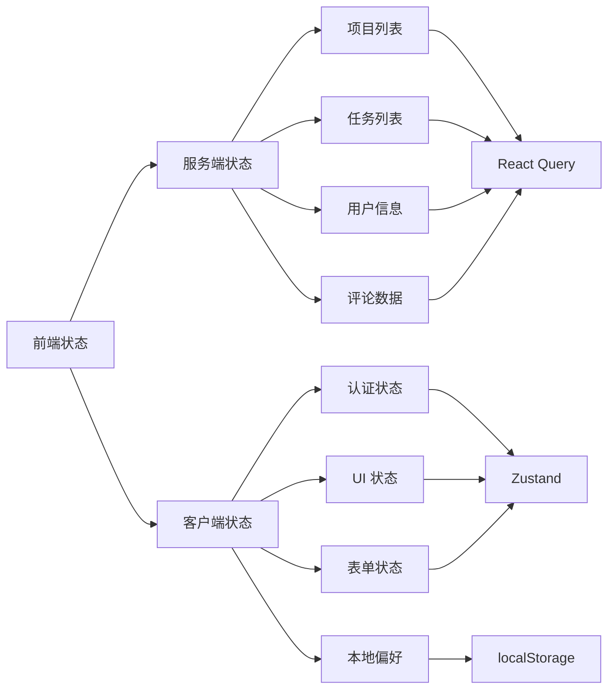
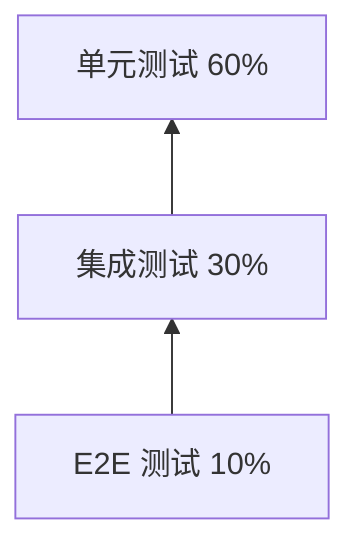
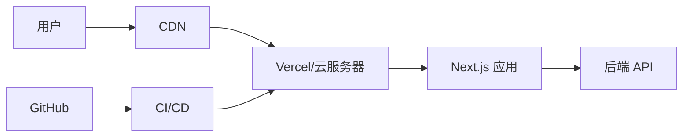

# ProjectHub 前端架构设计文档

| 文档版本 | 修改日期   | 修改人 | 修改内容   |
| -------- | ---------- | ------ | ---------- |
| v1.0     | 2026-03-11 | 架构组 | 初始版本   |

---

## 1. 技术选型

### 1.1 核心技术栈

| 技术类别 | 选型 | 版本 | 选型理由 |
| -------- | ---- | ---- | -------- |
| **框架** | React | 18.x | 生态成熟、社区活跃、性能优秀，支持并发渲染 |
| **元框架** | Next.js | 14.x | App Router 架构、服务端渲染、静态生成、路由约定 |
| **语言** | TypeScript | 5.x | 类型安全、IDE 支持好、减少运行时错误 |
| **UI 库** | Ant Design | 5.x | 企业级组件、主题定制能力强、文档完善 |
| **状态管理** | Zustand + TanStack Query | 最新 | Zustand 轻量简单，React Query 处理服务端状态 |
| **样式方案** | Tailwind CSS | 3.x | 原子化 CSS、开发效率高、包体积小 |
| **表单处理** | React Hook Form | 7.x | 性能好、API 简洁、TypeScript 友好 |
| **数据验证** | Zod | 3.x | Schema 验证、TypeScript 集成、错误信息友好 |
| **日期处理** | Day.js | 1.x | 轻量级、API 与 Moment 兼容 |
| **图表库** | Recharts | 2.x | React 原生、声明式 API、可定制性强 |
| **拖拽库** | @dnd-kit | 6.x | 现代拖拽库、无障碍支持、轻量级 |
| **Markdown** | @tanstack/react-markdown | 最新 | 支持 Markdown 渲染和编辑 |
| **HTTP 客户端** | Axios | 1.x | 拦截器、取消请求、TypeScript 支持 |
| **构建工具** | Turbopack | 最新 | Next.js 内置、增量编译、热更新快 |

### 1.2 开发工具链

| 工具 | 选型 | 说明 |
| ---- | ---- | ---- |
| **代码规范** | ESLint + Prettier | 代码质量和格式化 |
| **提交规范** | Commitlint + Husky | Git 提交信息校验 |
| **测试框架** | Vitest + Testing Library | 单元测试和组件测试 |
| **E2E 测试** | Playwright | 跨浏览器端到端测试 |
| **类型检查** | tsc --noEmit | TypeScript 类型校验 |

---

## 2. 项目目录结构

```
projecthub-frontend/
├── .github/                          # GitHub 配置
├── .husky/                           # Git hooks
├── .vscode/                          # VSCode 配置
├── public/                           # 静态资源
│   ├── favicon.ico
│   └── images/
├── src/
│   ├── app/                          # Next.js App Router 路由
│   │   ├── (auth)/                   # 认证相关路由组
│   │   │   ├── login/
│   │   │   │   └── page.tsx
│   │   │   ├── register/
│   │   │   │   └── page.tsx
│   │   │   └── layout.tsx
│   │   ├── (dashboard)/              # 需要认证的路由组
│   │   │   ├── dashboard/
│   │   │   │   └── page.tsx
│   │   │   ├── projects/
│   │   │   │   ├── page.tsx          # 项目列表
│   │   │   │   ├── new/
│   │   │   │   │   └── page.tsx      # 新建项目
│   │   │   │   └── [id]/
│   │   │   │       ├── page.tsx      # 项目详情
│   │   │   │       ├── tasks/
│   │   │   │       │   └── page.tsx  # 任务看板
│   │   │   │       ├── stories/
│   │   │   │       │   └── page.tsx  # 用户故事
│   │   │   │       ├── issues/
│   │   │   │       │   └── page.tsx  # 问题追踪
│   │   │   │       ├── wiki/
│   │   │   │       │   └── page.tsx  # Wiki 文档
│   │   │   │       ├── reports/
│   │   │   │       │   └── page.tsx  # 数据报表
│   │   │   │       ├── members/
│   │   │   │       │   └── page.tsx  # 成员管理
│   │   │   │       └── settings/
│   │   │   │           └── page.tsx  # 项目设置
│   │   │   ├── tasks/
│   │   │   │   └── [id]/
│   │   │   │       └── page.tsx      # 任务详情
│   │   │   ├── wiki/
│   │   │   │   └── page.tsx          # Wiki 知识库
│   │   │   ├── notifications/
│   │   │   │   └── page.tsx          # 消息通知
│   │   │   ├── reports/
│   │   │   │   └── page.tsx          # 数据报表
│   │   │   ├── settings/
│   │   │   │   └── page.tsx          # 个人设置
│   │   │   ├── admin/
│   │   │   │   └── page.tsx          # 管理后台
│   │   │   └── layout.tsx            # 认证路由布局
│   │   ├── api/                      # API 路由 (BFF 层)
│   │   │   └── [...route]/
│   │   │       └── route.ts
│   │   ├── layout.tsx                # 根布局
│   │   ├── page.tsx                  # 首页/着陆页
│   │   ├── globals.css               # 全局样式
│   │   └── not-found.tsx             # 404 页面
│   │
│   ├── components/                   # 组件
│   │   ├── ui/                       # 基础 UI 组件
│   │   │   ├── Button/
│   │   │   │   ├── Button.tsx
│   │   │   │   ├── Button.stories.tsx
│   │   │   │   └── index.ts
│   │   │   ├── Input/
│   │   │   ├── Modal/
│   │   │   ├── Table/
│   │   │   ├── Card/
│   │   │   ├── Badge/
│   │   │   ├── Avatar/
│   │   │   ├── Dropdown/
│   │   │   ├── Tabs/
│   │   │   ├── Form/
│   │   │   ├── Select/
│   │   │   ├── DatePicker/
│   │   │   ├── Tooltip/
│   │   │   ├── Toast/
│   │   │   ├── Skeleton/
│   │   │   └── Empty/
│   │   │
│   │   ├── layout/                   # 布局组件
│   │   │   ├── Header/
│   │   │   │   ├── Header.tsx
│   │   │   │   └── index.ts
│   │   │   ├── Sidebar/
│   │   │   │   ├── Sidebar.tsx
│   │   │   │   └── index.ts
│   │   │   ├── Footer/
│   │   │   ├── MainLayout/
│   │   │   └── AuthLayout/
│   │   │
│   │   ├── common/                   # 公共业务组件
│   │   │   ├── SearchBar/
│   │   │   ├── FilterBar/
│   │   │   ├── Pagination/
│   │   │   ├── Loading/
│   │   │   ├── ErrorBoundary/
│   │   │   └── ConfirmModal/
│   │   │
│   │   ├── features/                 # 业务功能组件
│   │   │   ├── auth/                 # 认证相关
│   │   │   │   ├── LoginForm/
│   │   │   │   ├── RegisterForm/
│   │   │   │   └── SocialLogin/
│   │   │   ├── project/              # 项目相关
│   │   │   │   ├── ProjectCard/
│   │   │   │   ├── ProjectList/
│   │   │   │   ├── ProjectForm/
│   │   │   │   ├── ProjectFilter/
│   │   │   │   └── MemberSelector/
│   │   │   ├── task/                 # 任务相关
│   │   │   │   ├── TaskCard/
│   │   │   │   ├── TaskList/
│   │   │   │   ├── TaskForm/
│   │   │   │   ├── TaskDetail/
│   │   │   │   ├── SubTaskList/
│   │   │   │   └── TaskComment/
│   │   │   ├── kanban/               # 看板相关
│   │   │   │   ├── KanbanBoard/
│   │   │   │   ├── KanbanColumn/
│   │   │   │   ├── KanbanCard/
│   │   │   │   └── KanbanDragDrop/
│   │   │   ├── dashboard/            # 仪表盘相关
│   │   │   │   ├── StatsCard/
│   │   │   │   ├── BentoGrid/
│   │   │   │   ├── RecentProjects/
│   │   │   │   ├── PendingTasks/
│   │   │   │   └── ActivityFeed/
│   │   │   ├── story/                # 用户故事相关
│   │   │   │   ├── EpicList/
│   │   │   │   ├── StoryList/
│   │   │   │   └── StoryForm/
│   │   │   ├── issue/                # 问题追踪相关
│   │   │   │   ├── IssueList/
│   │   │   │   ├── IssueForm/
│   │   │   │   └── BugReport/
│   │   │   ├── wiki/                 # Wiki 相关
│   │   │   │   ├── WikiEditor/
│   │   │   │   ├── WikiTree/
│   │   │   │   └── MarkdownViewer/
│   │   │   ├── report/               # 报表相关
│   │   │   │   ├── BurndownChart/
│   │   │   │   ├── CumulativeFlow/
│   │   │   │   ├── VelocityChart/
│   │   │   │   └── TaskDistribution/
│   │   │   └── notification/         # 通知相关
│   │   │       ├── NotificationList/
│   │   │       └── NotificationItem/
│   │   │
│   │   └── charts/                   # 图表组件
│   │       ├── BarChart/
│   │       ├── LineChart/
│   │       ├── PieChart/
│   │       └── AreaChart/
│   │
│   ├── lib/                          # 工具库
│   │   ├── api/                      # API 客户端
│   │   │   ├── axios.ts              # Axios 实例配置
│   │   │   ├── interceptors.ts       # 请求/响应拦截器
│   │   │   └── endpoints.ts          # API 端点常量
│   │   ├── utils/                    # 工具函数
│   │   │   ├── cn.ts                 # 类名合并 (classnames)
│   │   │   ├── format.ts             # 格式化函数
│   │   │   ├── validate.ts           # 验证函数
│   │   │   └── storage.ts            # 本地存储封装
│   │   ├── hooks/                    # 自定义 Hooks
│   │   │   ├── useAuth.ts            # 认证 Hook
│   │   │   ├── useProject.ts         # 项目相关 Hook
│   │   │   ├── useTask.ts            # 任务相关 Hook
│   │   │   ├── useKanban.ts          # 看板拖拽 Hook
│   │   │   ├── useNotification.ts    # 通知 Hook
│   │   │   └── useLocalStorage.ts    # 本地存储 Hook
│   │   └── constants/                # 常量定义
│   │       ├── routes.ts             # 路由常量
│   │       ├── status.ts             # 状态常量
│   │       ├── priority.ts           # 优先级常量
│   │       └── permissions.ts        # 权限常量
│   │
│   ├── stores/                       # 状态管理
│   │   ├── auth.store.ts             # 认证状态
│   │   ├── project.store.ts          # 项目状态
│   │   ├── task.store.ts             # 任务状态
│   │   ├── notification.store.ts     # 通知状态
│   │   └── ui.store.ts               # UI 状态 (模态框、侧边栏等)
│   │
│   ├── types/                        # TypeScript 类型定义
│   │   ├── api.ts                    # API 相关类型
│   │   ├── user.ts                   # 用户类型
│   │   ├── project.ts                # 项目类型
│   │   ├── task.ts                   # 任务类型
│   │   ├── story.ts                  # 用户故事类型
│   │   ├── issue.ts                  # 问题类型
│   │   ├── comment.ts                # 评论类型
│   │   └── common.ts                 # 通用类型
│   │
│   ├── config/                       # 配置文件
│   │   ├── app.config.ts             # 应用配置
│   │   ├── menu.config.ts            # 菜单配置
│   │   └── theme.config.ts           # 主题配置
│   │
│   └── middleware.ts                 # Next.js 中间件 (认证校验)
│
├── tests/                            # 测试文件
│   ├── unit/                         # 单元测试
│   ├── components/                   # 组件测试
│   └── e2e/                          # E2E 测试
│
├── .env.local                        # 本地环境变量
├── .env.example                      # 环境变量示例
├── .eslintrc.js                      # ESLint 配置
├── .prettierrc                       # Prettier 配置
├── next.config.js                    # Next.js 配置
├── tailwind.config.js                # Tailwind 配置
├── tsconfig.json                     # TypeScript 配置
├── package.json                      # 依赖配置
└── README.md                         # 项目说明
```

---

## 3. 架构设计

### 3.1 前端系统架构图



### 3.2 组件层次结构



### 3.3 认证流程图



---

## 4. 路由设计

### 4.1 路由结构

| 路由路径 | 页面组件 | 认证要求 | 权限要求 | 说明 |
| -------- | -------- | -------- | -------- | ---- |
| `/` | LandingPage | 无 | 无 | 产品官网/着陆页 |
| `/login` | LoginPage | 无 | 无 | 用户登录 |
| `/register` | RegisterPage | 无 | 无 | 用户注册 |
| `/dashboard` | DashboardPage | 需要 | 登录用户 | 个人工作台 |
| `/projects` | ProjectListPage | 需要 | 登录用户 | 项目列表 |
| `/projects/new` | NewProjectPage | 需要 | 项目经理 + | 新建项目 |
| `/projects/:id` | ProjectDetailPage | 需要 | 项目成员 | 项目详情 |
| `/projects/:id/tasks` | TaskBoardPage | 需要 | 项目成员 | 任务看板 |
| `/projects/:id/stories` | StoryPage | 需要 | 项目成员 | 用户故事 |
| `/projects/:id/issues` | IssuePage | 需要 | 项目成员 | 问题追踪 |
| `/projects/:id/wiki` | WikiPage | 需要 | 项目成员 | Wiki 文档 |
| `/projects/:id/reports` | ReportPage | 需要 | 项目成员 | 数据报表 |
| `/projects/:id/members` | MemberPage | 需要 | 项目成员 | 成员管理 |
| `/projects/:id/settings` | SettingPage | 需要 | 项目经理 + | 项目设置 |
| `/tasks/:id` | TaskDetailPage | 需要 | 项目成员 | 任务详情 |
| `/wiki` | WikiListPage | 需要 | 登录用户 | Wiki 知识库 |
| `/notifications` | NotificationPage | 需要 | 登录用户 | 消息通知 |
| `/reports` | ReportListPage | 需要 | 登录用户 | 数据报表 |
| `/settings` | UserSettingPage | 需要 | 登录用户 | 个人设置 |
| `/admin` | AdminPage | 需要 | 管理员 | 管理后台 |

### 4.2 路由守卫设计

```typescript
// middleware.ts
import { NextResponse } from 'next/server';
import type { NextRequest } from 'next/server';

const publicRoutes = ['/', '/login', '/register'];
const authRoutes = ['/login', '/register'];

export function middleware(request: NextRequest) {
  const { pathname } = request.nextUrl;
  const token = request.cookies.get('access_token')?.value;

  // 白名单路由直接放行
  if (publicRoutes.includes(pathname)) {
    return NextResponse.next();
  }

  // 未登录用户重定向到登录页
  if (!token) {
    const loginUrl = new URL('/login', request.url);
    loginUrl.searchParams.set('redirect', pathname);
    return NextResponse.redirect(loginUrl);
  }

  // 已登录用户访问登录/注册页，重定向到 dashboard
  if (authRoutes.includes(pathname)) {
    return NextResponse.redirect(new URL('/dashboard', request.url));
  }

  // TODO: 权限校验（基于用户角色）

  return NextResponse.next();
}

export const config = {
  matcher: ['/((?!api|_next/static|_next/image|favicon.ico).*)'],
};
```

---

## 5. 状态管理方案

### 5.1 状态分类



### 5.2 Zustand Store 设计

```typescript
// stores/auth.store.ts
interface AuthState {
  user: User | null;
  token: string | null;
  isAuthenticated: boolean;
  login: (credentials: LoginCredentials) => Promise<void>;
  logout: () => void;
  updateUser: (user: Partial<User>) => void;
}

// stores/project.store.ts
interface ProjectState {
  projects: Project[];
  currentProject: Project | null;
  loading: boolean;
  error: string | null;
  fetchProjects: () => Promise<void>;
  fetchProject: (id: string) => Promise<void>;
  createProject: (data: CreateProjectDto) => Promise<Project>;
  updateProject: (id: string, data: UpdateProjectDto) => Promise<void>;
  deleteProject: (id: string) => Promise<void>;
  setCurrentProject: (project: Project | null) => void;
}

// stores/ui.store.ts
interface UIState {
  sidebarCollapsed: boolean;
  currentTheme: 'light' | 'dark';
  modals: Record<string, boolean>;
  toggleSidebar: () => void;
  setTheme: (theme: 'light' | 'dark') => void;
  openModal: (name: string) => void;
  closeModal: (name: string) => void;
}
```

### 5.3 React Query 配置

```typescript
// lib/api/react-query.ts
import { QueryClient } from '@tanstack/react-query';

export const queryClient = new QueryClient({
  defaultOptions: {
    queries: {
      staleTime: 1000 * 60 * 5, // 5 分钟
      gcTime: 1000 * 60 * 10, // 10 分钟
      refetchOnWindowFocus: false,
      retry: 1,
    },
    mutations: {
      retry: 0,
    },
  },
});

// API Hook 示例
export function useProjects() {
  return useQuery({
    queryKey: ['projects'],
    queryFn: fetchProjects,
  });
}

export function useCreateProject() {
  return useMutation({
    mutationFn: createProject,
    onSuccess: () => {
      queryClient.invalidateQueries({ queryKey: ['projects'] });
    },
  });
}
```

---

## 6. API 接口设计

### 6.1 API 客户端封装

```typescript
// lib/api/axios.ts
import axios from 'axios';

const API_BASE_URL = process.env.NEXT_PUBLIC_API_URL || 'http://localhost:8080/api';

export const apiClient = axios.create({
  baseURL: API_BASE_URL,
  timeout: 10000,
  headers: {
    'Content-Type': 'application/json',
  },
});

// 请求拦截器
apiClient.interceptors.request.use(
  (config) => {
    const token = localStorage.getItem('access_token');
    if (token) {
      config.headers.Authorization = `Bearer ${token}`;
    }
    return config;
  },
  (error) => Promise.reject(error)
);

// 响应拦截器
apiClient.interceptors.response.use(
  (response) => response.data,
  (error) => {
    if (error.response?.status === 401) {
      // Token 过期，跳转到登录页
      localStorage.removeItem('access_token');
      window.location.href = '/login';
    }
    return Promise.reject(error);
  }
);
```

### 6.2 API 端点常量

```typescript
// lib/api/endpoints.ts
export const endpoints = {
  // 认证
  auth: {
    login: '/auth/login',
    register: '/auth/register',
    logout: '/auth/logout',
    refreshToken: '/auth/refresh',
    passwordReset: '/auth/password/reset',
  },
  // 用户
  user: {
    profile: '/user/profile',
    update: '/user/profile',
    avatar: '/user/avatar',
  },
  // 项目
  project: {
    list: '/projects',
    create: '/projects',
    detail: (id: string) => `/projects/${id}`,
    update: (id: string) => `/projects/${id}`,
    delete: (id: string) => `/projects/${id}`,
    members: (id: string) => `/projects/${id}/members`,
  },
  // 任务
  task: {
    list: '/tasks',
    create: '/tasks',
    detail: (id: string) => `/tasks/${id}`,
    update: (id: string) => `/tasks/${id}`,
    delete: (id: string) => `/tasks/${id}`,
    move: (id: string) => `/tasks/${id}/move`,
    comments: (id: string) => `/tasks/${id}/comments`,
  },
  // 用户故事
  story: {
    list: (projectId: string) => `/projects/${projectId}/stories`,
    create: (projectId: string) => `/projects/${projectId}/stories`,
    detail: (projectId: string, storyId: string) =>
      `/projects/${projectId}/stories/${storyId}`,
  },
  // 问题追踪
  issue: {
    list: (projectId: string) => `/projects/${projectId}/issues`,
    create: (projectId: string) => `/projects/${projectId}/issues`,
    detail: (projectId: string, issueId: string) =>
      `/projects/${projectId}/issues/${issueId}`,
  },
  // Wiki
  wiki: {
    list: (projectId: string) => `/projects/${projectId}/wiki`,
    create: (projectId: string) => `/projects/${projectId}/wiki`,
    detail: (projectId: string, docId: string) =>
      `/projects/${projectId}/wiki/${docId}`,
  },
  // 报表
  report: {
    burndown: (projectId: string) => `/projects/${projectId}/reports/burndown`,
    cumulativeFlow: (projectId: string) =>
      `/projects/${projectId}/reports/cumulative-flow`,
    velocity: (projectId: string) => `/projects/${projectId}/reports/velocity`,
  },
  // 通知
  notification: {
    list: '/notifications',
    unread: '/notifications/unread',
    markRead: (id: string) => `/notifications/${id}/read`,
    markAllRead: '/notifications/read-all',
  },
} as const;
```

---

## 7. 性能优化策略

### 7.1 代码分割与懒加载

```typescript
// 路由级别代码分割 - Next.js 自动处理
// 组件级别懒加载
import dynamic from 'next/dynamic';

const KanbanBoard = dynamic(() => import('@/components/features/kanban/KanbanBoard'), {
  loading: () => <Skeleton className="h-96" />,
  ssr: false, // 拖拽库可能有 SSR 问题
});

const Chart = dynamic(() => import('@/components/charts/LineChart'), {
  loading: () => <Skeleton className="h-64" />,
});
```

### 7.2 图片优化

```typescript
// 使用 Next.js Image 组件
import Image from 'next/image';

<Image
  src={avatarUrl}
  alt={userName}
  width={40}
  height={40}
  className="rounded-full"
  priority // 首屏图片预加载
/>
```

### 7.3 虚拟列表

```typescript
// 大数据列表使用虚拟滚动
import { useVirtualizer } from '@tanstack/react-virtual';

function VirtualTaskList({ tasks }: { tasks: Task[] }) {
  const parentRef = useRef<HTMLDivElement>(null);
  const virtualizer = useVirtualizer({
    count: tasks.length,
    getScrollElement: () => parentRef.current,
    estimateSize: () => 80,
  });

  return (
    <div ref={parentRef} className="h-96 overflow-auto">
      <div style={{ height: `${virtualizer.getTotalSize()}px` }}>
        {virtualizer.getVirtualItems().map((item) => (
          <TaskCard
            key={item.key}
            task={tasks[item.index]}
            style={{ transform: `translateY(${item.start}px)` }}
          />
        ))}
      </div>
    </div>
  );
}
```

### 7.4 防抖与节流

```typescript
// 搜索框防抖
function SearchBar() {
  const [query, setQuery] = useState('');

  const debouncedQuery = useDebounce(query, 300);

  const { data: searchResults } = useSearch(debouncedQuery);

  return <Input value={query} onChange={(e) => setQuery(e.target.value)} />;
}
```

---

## 8. 响应式设计方案

### 8.1 断点定义

```javascript
// tailwind.config.js
module.exports = {
  theme: {
    screens: {
      'sm': '640px',  // 手机横屏
      'md': '768px',  // 平板
      'lg': '1024px', // 小屏笔记本
      'xl': '1280px', // 桌面
      '2xl': '1536px',// 大屏
    },
  },
};
```

### 8.2 响应式布局策略

| 屏幕尺寸 | 侧边栏 | 主内容区 | 项目卡片 | 任务看板列 |
| -------- | ------ | -------- | -------- | ---------- |
| 手机 (<640px) | 隐藏/抽屉 | 100% | 1 列 | 单列垂直 |
| 平板 (768px) | 可收起 | 100% | 2 列 | 2 列 |
| 小屏 (1024px) | 展开 | 100% | 2 列 | 3 列 |
| 桌面 (1280px+) | 展开 | 100% | 3 列 | 4 列 |

### 8.3 移动端适配

```tsx
// 侧边栏组件响应式
function Sidebar() {
  const { collapsed, toggleSidebar } = useUIStore();

  return (
    <>
      {/* 移动端遮罩 */}
      {isOpen && (
        <div
          className="fixed inset-0 bg-black/50 z-40 md:hidden"
          onClick={toggleSidebar}
        />
      )}

      {/* 侧边栏主体 */}
      <aside className={cn(
        "fixed md:static inset-y-0 left-0 z-50 transition-transform",
        "md:translate-x-0",
        collapsed ? "-translate-x-full" : "translate-x-0"
      )}>
        {/* 内容 */}
      </aside>
    </>
  );
}
```

---

## 9. 无障碍访问方案

### 9.1 WCAG 2.1 AA 合规措施

| 要求 | 实施方案 |
| ---- | -------- |
| **键盘导航** | 所有交互元素支持 Tab 键访问，自定义组件实现键盘事件 |
| **焦点可见** | 自定义焦点样式，确保焦点清晰可见 |
| **颜色对比度** | 文字与背景对比度至少 4.5:1 |
| **ARIA 标签** | 为图标按钮、表单控件添加 aria-label |
| **屏幕阅读器** | 关键操作添加 aria-live 区域 |
| **跳过导航** | 添加"跳到主内容"链接 |

### 9.2 ARIA 实践

```tsx
// 图标按钮
<button
  aria-label="关闭侧边栏"
  onClick={toggleSidebar}
>
  <IconClose />
</button>

// 表单错误提示
<input
  aria-invalid={!!error}
  aria-describedby={error ? 'email-error' : undefined}
/>
{error && <span id="email-error" role="alert">{error}</span>}

// 加载状态
<div
  role="status"
  aria-live="polite"
  aria-label="加载中"
>
  <Spinner />
  <span className="sr-only">正在加载...</span>
</div>
```

---

## 10. 测试策略

### 10.1 测试金字塔



### 10.2 测试范围

| 测试类型 | 测试对象 | 工具 | 覆盖率要求 |
| -------- | -------- | ---- | ---------- |
| 单元测试 | 工具函数、Hooks、Store | Vitest | ≥80% |
| 组件测试 | UI 组件、业务组件 | Testing Library | ≥70% |
| 集成测试 | 模块间交互 | Vitest + MSW | 关键路径 |
| E2E 测试 | 用户关键流程 | Playwright | 核心流程 |

### 10.3 关键 E2E 测试场景

1. 用户注册 → 登录 → 创建项目 → 创建任务 → 拖拽任务 → 完成任务
2. 用户登录 → 搜索项目 → 进入项目 → 添加评论
3. 用户登录 → 查看仪表盘 → 查看报表 → 导出报表

---

## 11. 部署方案

### 11.1 部署架构图



### 11.2 环境变量配置

```bash
# .env.example
# 应用配置
NEXT_PUBLIC_APP_NAME=ProjectHub
NEXT_PUBLIC_APP_URL=https://app.projecthub.com

# API 配置
NEXT_PUBLIC_API_URL=https://api.projecthub.com
API_INTERNAL_URL=http://backend:8080

# 认证配置
NEXT_PUBLIC_AUTH_EXPIRES_IN=7d

# 监控配置
NEXT_PUBLIC_SENTRY_DSN=xxx
SENTRY_AUTH_TOKEN=xxx
```

### 11.3 Docker 部署

```dockerfile
# Dockerfile
FROM node:20-alpine AS base

# 依赖安装
FROM base AS deps
WORKDIR /app
COPY package.json yarn.lock ./
RUN yarn install --frozen-lockfile

# 构建
FROM base AS builder
WORKDIR /app
COPY --from=deps /app/node_modules ./node_modules
COPY . .
RUN yarn build

# 生产运行
FROM base AS runner
WORKDIR /app
ENV NODE_ENV=production

RUN addgroup --system --gid 1001 nodejs
RUN adduser --system --uid 1001 nextjs

COPY --from=builder /app/public ./public
COPY --from=builder --chown=nextjs:nodejs /app/.next/standalone ./
COPY --from=builder --chown=nextjs:nodejs /app/.next/static ./.next/static

USER nextjs

EXPOSE 3000

ENV PORT 3000
ENV HOSTNAME "0.0.0.0"

CMD ["node", "server.js"]
```

---

## 12. 验收标准

### 12.1 功能验收

| 序号 | 验收项 | 通过标准 |
| ---- | ------ | -------- |
| 1 | 用户注册登录 | 可成功注册、登录、退出，跳转正确 |
| 2 | 项目 CRUD | 可创建、查看、编辑、删除项目 |
| 3 | 任务管理 | 可创建、分配、更新、删除任务 |
| 4 | 看板拖拽 | 可拖拽任务卡片，状态实时更新 |
| 5 | 权限控制 | 无权限访问时正确拦截和提示 |
| 6 | 响应式布局 | 在三种尺寸屏幕下功能正常、布局正确 |

### 12.2 性能验收

| 序号 | 验收项 | 通过标准 | 测量工具 |
| ---- | ------ | -------- | -------- |
| 1 | 首屏加载 | LCP < 2.5s | Lighthouse |
| 2 | 交互响应 | FID < 100ms | Lighthouse |
| 3 | 视觉稳定 | CLS < 0.1 | Lighthouse |
| 4 | Lighthouse 得分 | 性能≥80, 可访问性≥90 | Lighthouse |
| 5 | 包体积 | main.js < 300KB (gzip) | Bundle Analyzer |

### 12.3 代码质量验收

| 序号 | 验收项 | 通过标准 |
| ---- | ------ | -------- |
| 1 | TypeScript | 无类型错误 |
| 2 | ESLint | 无错误，警告≤5 |
| 3 | 单元测试 | 通过率 100%，覆盖率≥80% |
| 4 | 组件测试 | 通过率 100%，覆盖率≥70% |
| 5 | E2E 测试 | 核心流程全部通过 |

---

## 附录

### A. 推荐 VSCode 插件

- ES7+ React/Redux/React-Native snippets
- Tailwind CSS IntelliSense
- Pretty TypeScript Errors
- Error Lens
- GitLens

### B. 学习资源

- [Next.js 官方文档](https://nextjs.org/docs)
- [React 官方文档](https://react.dev)
- [Ant Design 文档](https://ant.design)
- [Zustand 文档](https://docs.pmnd.rs/zustand)
- [TanStack Query 文档](https://tanstack.com/query)

---

**文档版本**: v1.0
**最后更新**: 2026-03-11
**审核状态**: 待审核
