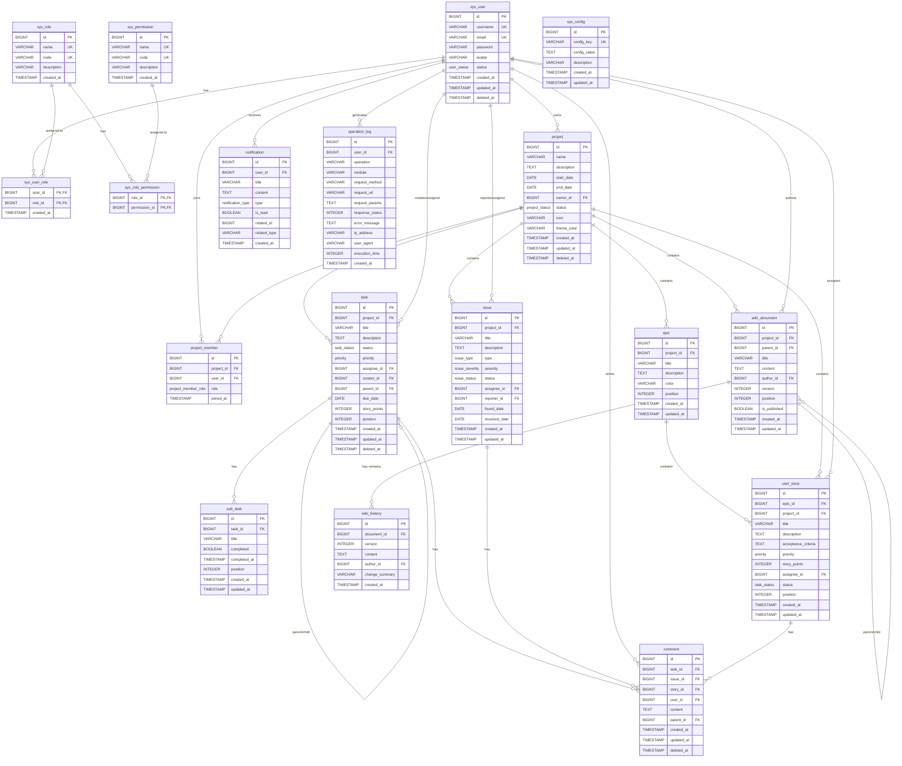
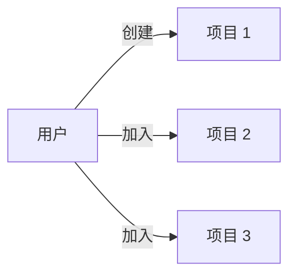
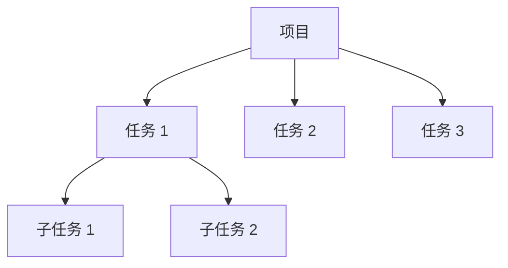
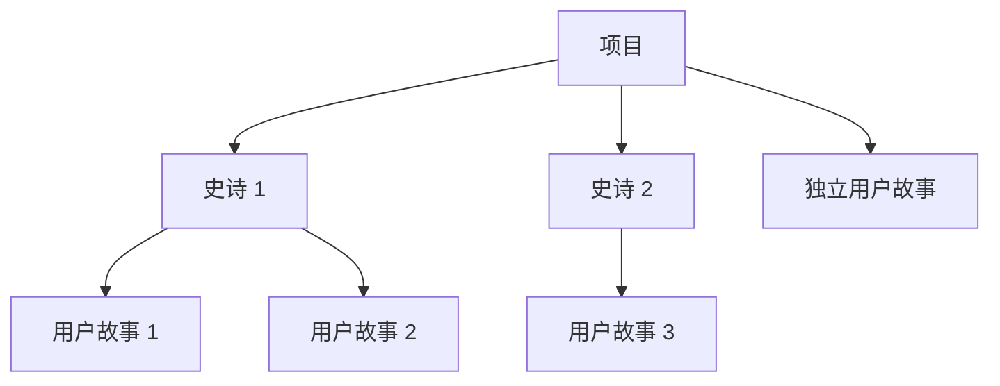
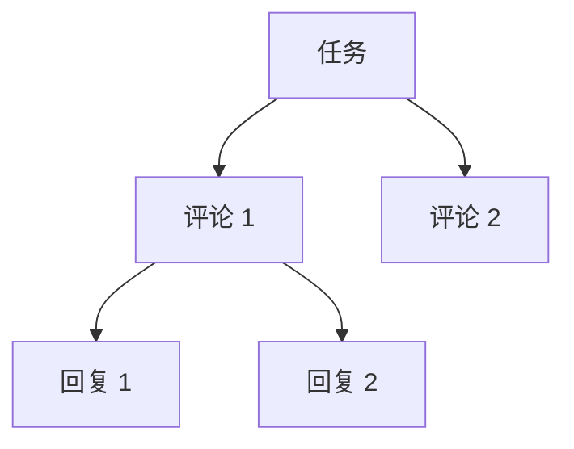
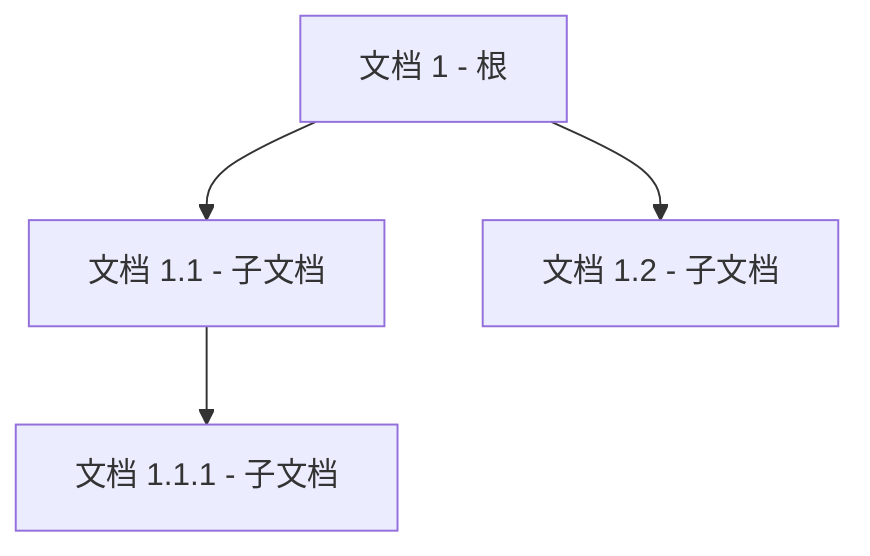

# ProjectHub 数据库 ER 图

| 文档版本 | 修改日期   | 修改人 | 修改内容 |
| -------- | ---------- | ------ | -------- |
| v1.0     | 2026-03-11 | 架构组 | 初始版本 |

---

## 实体关系图 (ER Diagram)

---

## 数据表说明

### 系统表 - 用户和权限

| 表名 | 说明 | 主要字段 |
| ---- | ---- | -------- |
| sys_user | 用户表 | id, username, email, password, status |
| sys_role | 角色表 | id, name, code, description |
| sys_permission | 权限表 | id, name, code, description |
| sys_user_role | 用户角色关联表 | user_id, role_id |
| sys_role_permission | 角色权限关联表 | role_id, permission_id |

### 项目模块

| 表名 | 说明 | 主要字段 | 外键 |
| ---- | ---- | -------- | ---- |
| project | 项目表 | id, name, description, start_date, end_date, status | owner_id → sys_user |
| project_member | 项目成员表 | id, project_id, user_id, role | project_id → project, user_id → sys_user |

### 任务模块

| 表名 | 说明 | 主要字段 | 外键 |
| ---- | ---- | -------- | ---- |
| task | 任务表 | id, title, description, status, priority, due_date | project_id → project, assignee_id → sys_user, creator_id → sys_user, parent_id → task |
| sub_task | 子任务表 | id, title, completed, position | task_id → task |
| comment | 评论表 | id, content, user_id | task_id → task, issue_id → issue, story_id → user_story, user_id → sys_user |

### 用户故事模块

| 表名 | 说明 | 主要字段 | 外键 |
| ---- | ---- | -------- | ---- |
| epic | 史诗表 | id, title, description, color, position | project_id → project |
| user_story | 用户故事表 | id, title, description, acceptance_criteria, priority, story_points | epic_id → epic, project_id → project, assignee_id → sys_user |

### 问题追踪模块

| 表名 | 说明 | 主要字段 | 外键 |
| ---- | ---- | -------- | ---- |
| issue | 问题表 | id, title, description, type, severity, status | project_id → project, assignee_id → sys_user, reporter_id → sys_user |

### Wiki 模块

| 表名 | 说明 | 主要字段 | 外键 |
| ---- | ---- | -------- | ---- |
| wiki_document | Wiki 文档表 | id, title, content, author_id, version, is_published | project_id → project, parent_id → wiki_document, author_id → sys_user |
| wiki_history | Wiki 历史表 | id, document_id, version, content, change_summary | document_id → wiki_document, author_id → sys_user |

### 通知模块

| 表名 | 说明 | 主要字段 | 外键 |
| ---- | ---- | -------- | ---- |
| notification | 通知表 | id, title, content, type, is_read, related_id | user_id → sys_user |

### 系统表

| 表名 | 说明 | 主要字段 |
| ---- | ---- | -------- |
| sys_config | 系统配置表 | id, config_key, config_value, description |
| operation_log | 操作日志表 | id, user_id, operation, module, request_url, ip_address |

---

## 枚举类型说明

### user_status (用户状态)

| 值 | 说明 |
| --- | ---- |
| ACTIVE | 正常 |
| INACTIVE | 未激活 |
| BANNED | 已禁用 |

### project_status (项目状态)

| 值 | 说明 |
| --- | ---- |
| ACTIVE | 进行中 |
| COMPLETED | 已完成 |
| ARCHIVED | 已归档 |

### task_status (任务状态)

| 值 | 说明 |
| --- | ---- |
| TODO | 待处理 |
| IN_PROGRESS | 进行中 |
| IN_REVIEW | 审查中 |
| DONE | 已完成 |

### priority (优先级)

| 值 | 说明 | 颜色标识 |
| --- | ---- | -------- |
| LOW | 低 | 绿色 |
| MEDIUM | 中 | 黄色 |
| HIGH | 高 | 橙色 |
| URGENT | 紧急 | 红色 |

### issue_type (问题类型)

| 值 | 说明 |
| --- | ---- |
| BUG | 功能缺陷 |
| ISSUE | 一般问题 |
| IMPROVEMENT | 改进建议 |
| TECH_DEBT | 技术债务 |

### issue_severity (问题严重程度)

| 值 | 说明 |
| --- | ---- |
| TRIVIAL | 轻微 |
| MINOR | 一般 |
| NORMAL | 普通 |
| MAJOR | 严重 |
| CRITICAL | 致命 |

### issue_status (问题状态)

| 值 | 说明 |
| --- | ---- |
| NEW | 新建 |
| CONFIRMED | 已确认 |
| IN_PROGRESS | 修复中 |
| RESOLVED | 已修复 |
| CLOSED | 已关闭 |
| REOPENED | 重新打开 |

### project_member_role (项目成员角色)

| 值 | 说明 |
| --- | ---- |
| OWNER | 负责人 |
| MANAGER | 管理员 |
| MEMBER | 普通成员 |

### notification_type (通知类型)

| 值 | 说明 |
| --- | ---- |
| INFO | 通知 |
| WARNING | 警告 |
| ERROR | 错误 |
| TASK | 任务相关 |
| PROJECT | 项目相关 |

---

## 核心业务关系说明

### 1. 用户与项目关系

- 一个用户可以创建多个项目 (作为 owner)
- 一个用户可以加入多个项目 (作为 member)
- 一个项目只能有一个 owner
- 一个项目可以有多个成员

### 2. 项目与任务关系

- 一个项目包含多个任务
- 任务可以有子任务 (自关联)
- 任务可以分配给一个用户
- 任务由一个用户创建

### 3. 史诗与用户故事关系

- 一个项目可以有多个史诗
- 一个史诗包含多个用户故事
- 用户故事也可以不属于任何史诗 (直接属于项目)
- 用户故事可以分配给一个用户

### 4. 评论关联关系

评论采用多态关联设计，可以关联到：
- 任务 (task_id)
- 问题 (issue_id)
- 用户故事 (story_id)

评论支持回复功能 (自关联 parent_id)

### 5. Wiki 文档层级关系

- Wiki 文档支持树形结构 (自关联 parent_id)
- 每次修改会递增 version 号
- 历史版本记录在 wiki_history 表

---

## 索引设计说明

### 用户表索引

| 索引名 | 字段 | 说明 |
| ------ | ---- | ---- |
| idx_user_email | email | 登录查询、邮箱唯一性校验 |
| idx_user_username | username | 用户名查询 |
| idx_user_status | status | 按状态筛选用户 |
| idx_user_deleted_at | deleted_at | 软删除查询 |

### 项目表索引

| 索引名 | 字段 | 说明 |
| ------ | ---- | ---- |
| idx_project_owner | owner_id | 查询用户创建的项目 |
| idx_project_status | status | 按状态筛选项目 |
| idx_project_deleted_at | deleted_at | 软删除查询 |
| idx_project_name | name | 项目名称搜索 |

### 任务表索引

| 索引名 | 字段 | 说明 |
| ------ | ---- | ---- |
| idx_task_project | project_id | 查询项目下的任务 |
| idx_task_assignee | assignee_id | 查询分配给用户的任务 |
| idx_task_creator | creator_id | 查询用户创建的任务 |
| idx_task_status | status | 按状态筛选任务 |
| idx_task_priority | priority | 按优先级筛选任务 |
| idx_task_parent | parent_id | 查询父任务 |
| idx_task_deleted_at | deleted_at | 软删除查询 |
| idx_task_project_status | project_id, status | 组合查询 (看板视图) |
| idx_task_project_position | project_id, position | 排序查询 |

### 评论表索引

| 索引名 | 字段 | 说明 |
| ------ | ---- | ---- |
| idx_comment_task | task_id | 查询任务评论 |
| idx_comment_issue | issue_id | 查询问题评论 |
| idx_comment_story | story_id | 查询故事评论 |
| idx_comment_user | user_id | 查询用户评论 |
| idx_comment_parent | parent_id | 查询回复 |
| idx_comment_deleted_at | deleted_at | 软删除查询 |

---

## 数据量预估

假设系统运行 1 年后：

| 表名 | 预估数据量 | 说明 |
| ---- | ---------- | ---- |
| sys_user | 1,000 | 用户数 |
| project | 500 | 项目数 |
| project_member | 2,000 | 项目成员关联 |
| task | 20,000 | 任务数 (每项目约 40 个任务) |
| sub_task | 40,000 | 子任务数 (每任务约 2 个子任务) |
| comment | 100,000 | 评论数 |
| user_story | 5,000 | 用户故事数 |
| issue | 10,000 | 问题数 |
| wiki_document | 2,500 | Wiki 文档数 |
| wiki_history | 10,000 | Wiki 历史版本 |
| notification | 500,000 | 通知数 |
| operation_log | 1,000,000 | 操作日志 |

---

## 分库分表策略 (如需要)

当数据量达到一定规模后，可考虑以下分库分表策略：

### 1. 垂直拆分

将大表拆分为多个表：
- 将 `task` 表的 `description` 字段拆分到 `task_detail` 表
- 将 `wiki_document` 表的 `content` 字段拆分到 `wiki_content` 表

### 2. 水平拆分

按以下维度进行分表：
- `task` 表：按 `project_id` 分表
- `comment` 表：按 `task_id` 范围分表
- `notification` 表：按 `user_id` 分表
- `operation_log` 表：按 `created_at` 月份分表

### 3. 归档策略

- 任务完成 1 年后归档到 `task_archive` 表
- 通知已读 3 个月后删除
- 操作日志 1 年后归档到冷存储

---

## 视图说明

### v_project_stats (项目统计视图)

用于快速获取项目统计数据，包括：
- 任务总数
- 各状态任务数
- 成员数量
- 项目进度百分比

### v_task_detail (任务详情视图)

用于快速获取任务详细信息，包括：
- 任务基本信息
- 项目和负责人信息
- 子任务统计
- 评论数量

---

## 触发器说明

### update_updated_at_column

自动更新时间戳的触发器函数，应用于以下表：
- sys_user
- project
- task
- user_story
- wiki_document

当记录更新时，自动将 `updated_at` 字段设置为当前时间戳。

---

**文档版本**: v1.0
**最后更新**: 2026-03-11
**审核状态**: 待审核
