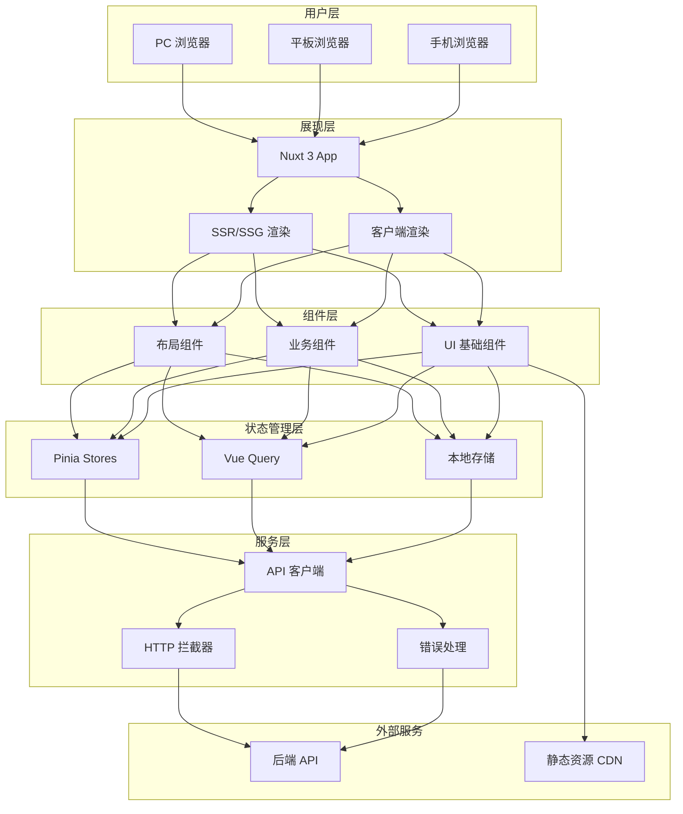
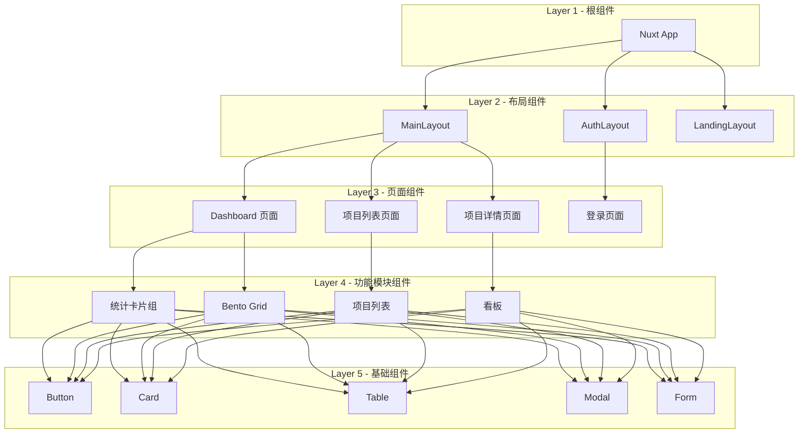
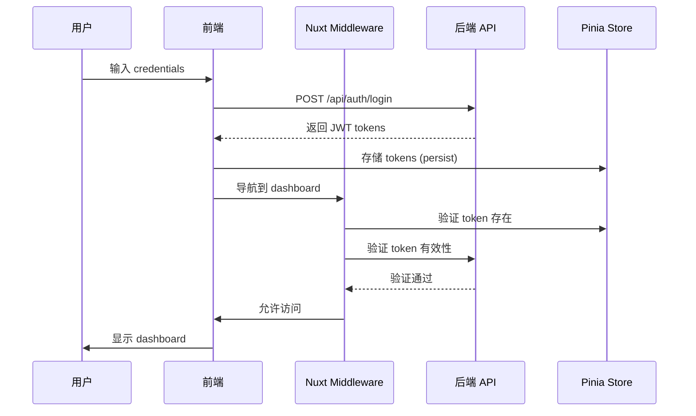
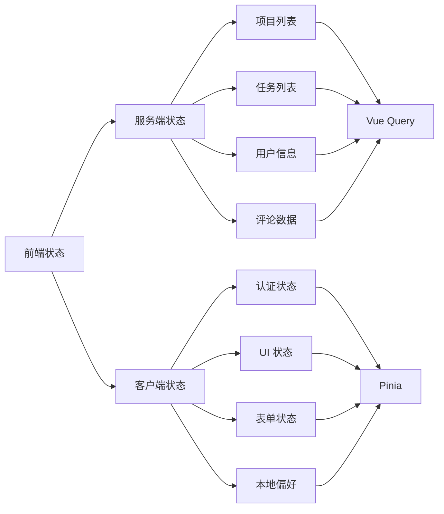
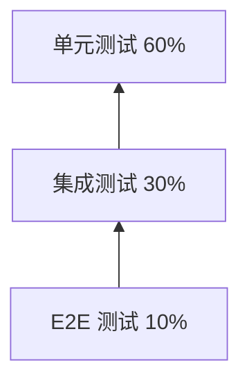
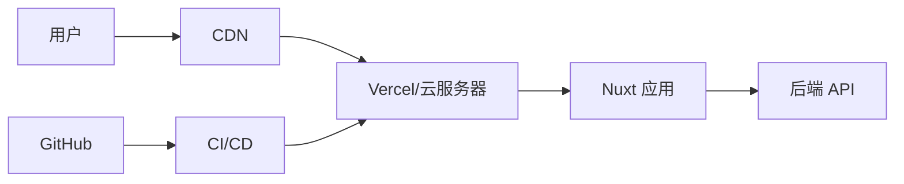

# ProjectHub 前端架构设计文档 (Vue3)

| 文档版本 | 修改日期   | 修改人 | 修改内容   |
| -------- | ---------- | ------ | ---------- |
| v1.0     | 2026-03-12 | 架构组 | 基于 React 版本迁移至 Vue3 |

---

## 1. 技术选型

### 1.1 核心技术栈

| 技术类别 | 选型 | 版本 | 选型理由 |
| -------- | ---- | ---- | -------- |
| **框架** | Vue | 3.x | 渐进式框架、上手简单、性能优秀，支持组合式 API |
| **元框架** | Nuxt | 3.x | 全栈框架、服务端渲染、静态生成、自动导入 |
| **语言** | TypeScript | 5.x | 类型安全、IDE 支持好、减少运行时错误 |
| **UI 库** | Ant Design Vue | 4.x | 企业级组件、主题定制能力强、文档完善 |
| **状态管理** | Pinia + Vue Query | 最新 | Pinia 官方推荐，Vue Query 处理服务端状态 |
| **样式方案** | Tailwind CSS | 3.x | 原子化 CSS、开发效率高、包体积小 |
| **表单处理** | VeeValidate | 4.x | Vue 原生、功能强大、TypeScript 友好 |
| **数据验证** | Zod | 3.x | Schema 验证、TypeScript 集成、错误信息友好 |
| **日期处理** | Day.js | 1.x | 轻量级、API 与 Moment 兼容 |
| **图表库** | Vue-ECharts | 6.x | Vue 原生、基于 ECharts、功能强大 |
| **拖拽库** | Vue Draggable Plus | 最新 | Vue3 组合式 API、无缝迁移自 vuedraggable |
| **Markdown** | markdown-it + @vueuse/markdown | 最新 | 支持 Markdown 渲染和编辑 |
| **HTTP 客户端** | Axios | 1.x | 拦截器、取消请求、TypeScript 支持 |
| **构建工具** | Vite | 5.x | 极速启动、热更新快、Rollup 打包 |

### 1.2 开发工具链

| 工具 | 选型 | 说明 |
| ---- | ---- | ---- |
| **代码规范** | ESLint + Prettier | 代码质量和格式化 |
| **提交规范** | Commitlint + Husky | Git 提交信息校验 |
| **测试框架** | Vitest + Vue Test Utils | 单元测试和组件测试 |
| **E2E 测试** | Playwright | 跨浏览器端到端测试 |
| **类型检查** | vue-tsc | Vue TypeScript 类型校验 |

---

## 2. 项目目录结构

```
projecthub-frontend/
├── .github/                          # GitHub 配置
├── .husky/                           # Git hooks
├── .vscode/                          # VSCode 配置
├── public/                           # 静态资源
│   ├── favicon.ico
│   └── images/
├── src/
│   ├── pages/                        # Nuxt 页面路由
│   │   ├── (auth)/                   # 认证相关路由组
│   │   │   ├── login.vue
│   │   │   ├── register.vue
│   │   │   └── index.vue
│   │   ├── (dashboard)/              # 需要认证的路由组
│   │   │   ├── dashboard.vue
│   │   │   ├── projects/
│   │   │   │   ├── index.vue         # 项目列表
│   │   │   │   ├── new.vue           # 新建项目
│   │   │   │   └── [id]/
│   │   │   │       ├── index.vue     # 项目详情
│   │   │   │       ├── tasks/
│   │   │   │       │   └── index.vue # 任务看板
│   │   │   │       ├── stories/
│   │   │   │       │   └── index.vue # 用户故事
│   │   │   │       ├── issues/
│   │   │   │       │   └── index.vue # 问题追踪
│   │   │   │       ├── wiki/
│   │   │   │       │   └── index.vue # Wiki 文档
│   │   │   │       ├── reports/
│   │   │   │       │   └── index.vue # 数据报表
│   │   │   │       ├── members/
│   │   │   │       │   └── index.vue # 成员管理
│   │   │   │       └── settings/
│   │   │   │           └── index.vue # 项目设置
│   │   │   ├── tasks/
│   │   │   │   └── [id].vue          # 任务详情
│   │   │   ├── wiki.vue              # Wiki 知识库
│   │   │   ├── notifications.vue     # 消息通知
│   │   │   ├── reports.vue           # 数据报表
│   │   │   ├── settings.vue          # 个人设置
│   │   │   └── admin.vue             # 管理后台
│   │   ├── index.vue                 # 首页/着陆页
│   │   └── 404.vue                   # 404 页面
│   │
│   ├── components/                   # 组件
│   │   ├── ui/                       # 基础 UI 组件
│   │   │   ├── Button/
│   │   │   │   ├── Button.vue
│   │   │   │   ├── Button.stories.ts
│   │   │   │   └── index.ts
│   │   │   ├── Input/
│   │   │   ├── Modal/
│   │   │   ├── Table/
│   │   │   ├── Card/
│   │   │   ├── Badge/
│   │   │   ├── Avatar/
│   │   │   ├── Dropdown/
│   │   │   ├── Tabs/
│   │   │   ├── Form/
│   │   │   ├── Select/
│   │   │   ├── DatePicker/
│   │   │   ├── Tooltip/
│   │   │   ├── Toast/
│   │   │   ├── Skeleton/
│   │   │   └── Empty/
│   │   │
│   │   ├── layout/                   # 布局组件
│   │   │   ├── Header/
│   │   │   │   ├── Header.vue
│   │   │   │   └── index.ts
│   │   │   ├── Sidebar/
│   │   │   │   ├── Sidebar.vue
│   │   │   │   └── index.ts
│   │   │   ├── Footer/
│   │   │   ├── MainLayout/
│   │   │   └── AuthLayout/
│   │   │
│   │   ├── common/                   # 公共业务组件
│   │   │   ├── SearchBar/
│   │   │   ├── FilterBar/
│   │   │   ├── Pagination/
│   │   │   ├── Loading/
│   │   │   ├── ErrorBoundary/
│   │   │   └── ConfirmModal/
│   │   │
│   │   ├── features/                 # 业务功能组件
│   │   │   ├── auth/                 # 认证相关
│   │   │   │   ├── LoginForm/
│   │   │   │   ├── RegisterForm/
│   │   │   │   └── SocialLogin/
│   │   │   ├── project/              # 项目相关
│   │   │   │   ├── ProjectCard/
│   │   │   │   ├── ProjectList/
│   │   │   │   ├── ProjectForm/
│   │   │   │   ├── ProjectFilter/
│   │   │   │   └── MemberSelector/
│   │   │   ├── task/                 # 任务相关
│   │   │   │   ├── TaskCard/
│   │   │   │   ├── TaskList/
│   │   │   │   ├── TaskForm/
│   │   │   │   ├── TaskDetail/
│   │   │   │   ├── SubTaskList/
│   │   │   │   └── TaskComment/
│   │   │   ├── kanban/               # 看板相关
│   │   │   │   ├── KanbanBoard/
│   │   │   │   ├── KanbanColumn/
│   │   │   │   ├── KanbanCard/
│   │   │   │   └── KanbanDragDrop/
│   │   │   ├── dashboard/            # 仪表盘相关
│   │   │   │   ├── StatsCard/
│   │   │   │   ├── BentoGrid/
│   │   │   │   ├── RecentProjects/
│   │   │   │   ├── PendingTasks/
│   │   │   │   └── ActivityFeed/
│   │   │   ├── story/                # 用户故事相关
│   │   │   │   ├── EpicList/
│   │   │   │   ├── StoryList/
│   │   │   │   └── StoryForm/
│   │   │   ├── issue/                # 问题追踪相关
│   │   │   │   ├── IssueList/
│   │   │   │   ├── IssueForm/
│   │   │   │   └── BugReport/
│   │   │   ├── wiki/                 # Wiki 相关
│   │   │   │   ├── WikiEditor/
│   │   │   │   ├── WikiTree/
│   │   │   │   └── MarkdownViewer/
│   │   │   ├── report/               # 报表相关
│   │   │   │   ├── BurndownChart/
│   │   │   │   ├── CumulativeFlow/
│   │   │   │   ├── VelocityChart/
│   │   │   │   └── TaskDistribution/
│   │   │   └── notification/         # 通知相关
│   │   │       ├── NotificationList/
│   │   │       └── NotificationItem/
│   │   │
│   │   └── charts/                   # 图表组件
│   │       ├── BarChart/
│   │       ├── LineChart/
│   │       ├── PieChart/
│   │       └── AreaChart/
│   │
│   ├── composables/                  # 组合式函数 (Hooks)
│   │   ├── useAuth.ts                # 认证 Composable
│   │   ├── useProject.ts             # 项目相关 Composable
│   │   ├── useTask.ts                # 任务相关 Composable
│   │   ├── useKanban.ts              # 看板拖拽 Composable
│   │   ├── useNotification.ts        # 通知 Composable
│   │   └── useLocalStorage.ts        # 本地存储 Composable
│   │
│   ├── lib/                          # 工具库
│   │   ├── api/                      # API 客户端
│   │   │   ├── axios.ts              # Axios 实例配置
│   │   │   ├── interceptors.ts       # 请求/响应拦截器
│   │   │   └── endpoints.ts          # API 端点常量
│   │   ├── utils/                    # 工具函数
│   │   │   ├── cn.ts                 # 类名合并 (classnames)
│   │   │   ├── format.ts             # 格式化函数
│   │   │   ├── validate.ts           # 验证函数
│   │   │   └── storage.ts            # 本地存储封装
│   │   └── constants/                # 常量定义
│   │       ├── routes.ts             # 路由常量
│   │       ├── status.ts             # 状态常量
│   │       ├── priority.ts           # 优先级常量
│   │       └── permissions.ts        # 权限常量
│   │
│   ├── stores/                       # Pinia 状态管理
│   │   ├── auth.store.ts             # 认证状态
│   │   ├── project.store.ts          # 项目状态
│   │   ├── task.store.ts             # 任务状态
│   │   ├── notification.store.ts     # 通知状态
│   │   └── ui.store.ts               # UI 状态 (模态框、侧边栏等)
│   │
│   ├── types/                        # TypeScript 类型定义
│   │   ├── api.ts                    # API 相关类型
│   │   ├── user.ts                   # 用户类型
│   │   ├── project.ts                # 项目类型
│   │   ├── task.ts                   # 任务类型
│   │   ├── story.ts                  # 用户故事类型
│   │   ├── issue.ts                  # 问题类型
│   │   ├── comment.ts                # 评论类型
│   │   └── common.ts                 # 通用类型
│   │
│   ├── config/                       # 配置文件
│   │   ├── app.config.ts             # 应用配置
│   │   ├── menu.config.ts            # 菜单配置
│   │   └── theme.config.ts           # 主题配置
│   │
│   ├── middleware/                   # Nuxt 中间件
│   │   └── auth.global.ts            # 全局认证中间件
│   │
│   ├── plugins/                      # Nuxt 插件
│   │   ├── axios.client.ts           # Axios 客户端插件
│   │   └── antd.ts                   # Ant Design Vue 插件
│   │
│   └── layouts/                      # Nuxt 布局
│       ├── default.vue               # 默认布局
│       └── auth.vue                  # 认证布局
│
├── tests/                            # 测试文件
│   ├── unit/                         # 单元测试
│   ├── components/                   # 组件测试
│   └── e2e/                          # E2E 测试
│
├── .env.local                        # 本地环境变量
├── .env.example                      # 环境变量示例
├── .eslintrc.js                      # ESLint 配置
├── .prettierrc                       # Prettier 配置
├── nuxt.config.ts                    # Nuxt 配置
├── tailwind.config.js                # Tailwind 配置
├── tsconfig.json                     # TypeScript 配置
├── package.json                      # 依赖配置
└── README.md                         # 项目说明
```

---

## 3. 架构设计

### 3.1 前端系统架构图



### 3.2 组件层次结构



### 3.3 认证流程图



---

## 4. 路由设计

### 4.1 路由结构

| 路由路径 | 页面组件 | 认证要求 | 权限要求 | 说明 |
| -------- | -------- | -------- | -------- | ---- |
| `/` | LandingPage | 无 | 无 | 产品官网/着陆页 |
| `/login` | LoginPage | 无 | 无 | 用户登录 |
| `/register` | RegisterPage | 无 | 无 | 用户注册 |
| `/dashboard` | DashboardPage | 需要 | 登录用户 | 个人工作台 |
| `/projects` | ProjectListPage | 需要 | 登录用户 | 项目列表 |
| `/projects/new` | NewProjectPage | 需要 | 项目经理 + | 新建项目 |
| `/projects/:id` | ProjectDetailPage | 需要 | 项目成员 | 项目详情 |
| `/projects/:id/tasks` | TaskBoardPage | 需要 | 项目成员 | 任务看板 |
| `/projects/:id/stories` | StoryPage | 需要 | 项目成员 | 用户故事 |
| `/projects/:id/issues` | IssuePage | 需要 | 项目成员 | 问题追踪 |
| `/projects/:id/wiki` | WikiPage | 需要 | 项目成员 | Wiki 文档 |
| `/projects/:id/reports` | ReportPage | 需要 | 项目成员 | 数据报表 |
| `/projects/:id/members` | MemberPage | 需要 | 项目成员 | 成员管理 |
| `/projects/:id/settings` | SettingPage | 需要 | 项目经理 + | 项目设置 |
| `/tasks/:id` | TaskDetailPage | 需要 | 项目成员 | 任务详情 |
| `/wiki` | WikiListPage | 需要 | 登录用户 | Wiki 知识库 |
| `/notifications` | NotificationPage | 需要 | 登录用户 | 消息通知 |
| `/reports` | ReportListPage | 需要 | 登录用户 | 数据报表 |
| `/settings` | UserSettingPage | 需要 | 登录用户 | 个人设置 |
| `/admin` | AdminPage | 需要 | 管理员 | 管理后台 |

### 4.2 路由守卫设计

```typescript
// middleware/auth.global.ts
export default defineNuxtRouteMiddleware(async (to, from) => {
  const authStore = useAuthStore();

  // 白名单路由
  const publicRoutes = ['/', '/login', '/register'];
  if (publicRoutes.includes(to.path)) {
    return;
  }

  // 未登录用户重定向到登录页
  if (!authStore.isAuthenticated) {
    return navigateTo({
      path: '/login',
      query: { redirect: to.fullPath }
    });
  }

  // 已登录用户访问登录/注册页，重定向到 dashboard
  const authRoutes = ['/login', '/register'];
  if (authRoutes.includes(to.path)) {
    return navigateTo('/dashboard');
  }

  // TODO: 权限校验（基于用户角色）
});
```

---

## 5. 状态管理方案

### 5.1 状态分类



### 5.2 Pinia Store 设计

```typescript
// stores/auth.store.ts
import { defineStore } from 'pinia';

interface AuthState {
  user: User | null;
  token: string | null;
  isAuthenticated: boolean;
  login: (credentials: LoginCredentials) => Promise<void>;
  logout: () => void;
  updateUser: (user: Partial<User>) => void;
}

export const useAuthStore = defineStore('auth', {
  state: (): AuthState => ({
    user: null,
    token: null,
    isAuthenticated: false,
  }),

  actions: {
    async login(credentials: LoginCredentials) {
      const { data } = await apiClient.post('/auth/login', credentials);
      this.token = data.token;
      this.user = data.user;
      this.isAuthenticated = true;
      localStorage.setItem('access_token', data.token);
    },

    logout() {
      this.user = null;
      this.token = null;
      this.isAuthenticated = false;
      localStorage.removeItem('access_token');
    },

    updateUser(user: Partial<User>) {
      if (this.user) {
        this.user = { ...this.user, ...user };
      }
    },
  },

  persist: {
    key: 'auth-store',
    storage: localStorage,
    paths: ['token', 'user'],
  },
});

// stores/project.store.ts
export const useProjectStore = defineStore('project', {
  state: () => ({
    projects: [] as Project[],
    currentProject: null as Project | null,
    loading: false,
    error: null as string | null,
  }),

  actions: {
    async fetchProjects() {
      this.loading = true;
      try {
        const { data } = await apiClient.get('/projects');
        this.projects = data;
      } catch (error) {
        this.error = (error as Error).message;
      } finally {
        this.loading = false;
      }
    },

    async fetchProject(id: string) {
      this.loading = true;
      try {
        const { data } = await apiClient.get(`/projects/${id}`);
        this.currentProject = data;
      } catch (error) {
        this.error = (error as Error).message;
      } finally {
        this.loading = false;
      }
    },

    async createProject(projectData: CreateProjectDto) {
      const { data } = await apiClient.post('/projects', projectData);
      this.projects.push(data);
      return data;
    },

    setCurrentProject(project: Project | null) {
      this.currentProject = project;
    },
  },
});

// stores/ui.store.ts
export const useUIStore = defineStore('ui', {
  state: () => ({
    sidebarCollapsed: false,
    sidebarOpen: false,
    currentTheme: 'light' as 'light' | 'dark',
    modals: {} as Record<string, boolean>,
  }),

  actions: {
    toggleSidebar() {
      this.sidebarCollapsed = !this.sidebarCollapsed;
    },

    openMobileSidebar() {
      this.sidebarOpen = true;
    },

    closeMobileSidebar() {
      this.sidebarOpen = false;
    },

    setTheme(theme: 'light' | 'dark') {
      this.currentTheme = theme;
      document.documentElement.classList.toggle('dark', theme === 'dark');
    },

    openModal(name: string) {
      this.modals[name] = true;
    },

    closeModal(name: string) {
      this.modals[name] = false;
    },
  },

  persist: {
    key: 'ui-store',
    storage: localStorage,
    paths: ['sidebarCollapsed', 'currentTheme'],
  },
});
```

### 5.3 Vue Query 配置

```typescript
// lib/api/vue-query.ts
import { VueQueryPlugin, QueryClient } from '@tanstack/vue-query';

export const queryClient = new QueryClient({
  defaultOptions: {
    queries: {
      staleTime: 1000 * 60 * 5, // 5 分钟
      gcTime: 1000 * 60 * 10, // 10 分钟
      refetchOnWindowFocus: false,
      retry: 1,
    },
    mutations: {
      retry: 0,
    },
  },
});

// Composable Hook 示例
export function useProjectsQuery() {
  return useQuery({
    queryKey: ['projects'],
    queryFn: fetchProjects,
  });
}

export function useCreateProjectMutation() {
  const queryClient = useQueryClient();

  return useMutation({
    mutationFn: createProject,
    onSuccess: () => {
      queryClient.invalidateQueries({ queryKey: ['projects'] });
    },
  });
}
```

---

## 6. API 接口设计

### 6.1 API 客户端封装

```typescript
// lib/api/axios.ts
import axios from 'axios';

const API_BASE_URL = import.meta.env.VITE_PUBLIC_API_URL || 'http://localhost:8080/api';

export const apiClient = axios.create({
  baseURL: API_BASE_URL,
  timeout: 10000,
  headers: {
    'Content-Type': 'application/json',
  },
});

// 请求拦截器
apiClient.interceptors.request.use(
  (config) => {
    const token = localStorage.getItem('access_token');
    if (token) {
      config.headers.Authorization = `Bearer ${token}`;
    }
    return config;
  },
  (error) => Promise.reject(error)
);

// 响应拦截器
apiClient.interceptors.response.use(
  (response) => response.data,
  (error) => {
    if (error.response?.status === 401) {
      // Token 过期，跳转到登录页
      localStorage.removeItem('access_token');
      // 使用 Pinia store 更新状态
      const authStore = useAuthStore();
      authStore.logout();
      navigateTo('/login');
    }
    return Promise.reject(error);
  }
);
```

### 6.2 API 端点常量

```typescript
// lib/api/endpoints.ts
export const endpoints = {
  // 认证
  auth: {
    login: '/auth/login',
    register: '/auth/register',
    logout: '/auth/logout',
    refreshToken: '/auth/refresh',
    passwordReset: '/auth/password/reset',
  },
  // 用户
  user: {
    profile: '/user/profile',
    update: '/user/profile',
    avatar: '/user/avatar',
  },
  // 项目
  project: {
    list: '/projects',
    create: '/projects',
    detail: (id: string) => `/projects/${id}`,
    update: (id: string) => `/projects/${id}`,
    delete: (id: string) => `/projects/${id}`,
    members: (id: string) => `/projects/${id}/members`,
  },
  // 任务
  task: {
    list: '/tasks',
    create: '/tasks',
    detail: (id: string) => `/tasks/${id}`,
    update: (id: string) => `/tasks/${id}`,
    delete: (id: string) => `/tasks/${id}`,
    move: (id: string) => `/tasks/${id}/move`,
    comments: (id: string) => `/tasks/${id}/comments`,
  },
  // 用户故事
  story: {
    list: (projectId: string) => `/projects/${projectId}/stories`,
    create: (projectId: string) => `/projects/${projectId}/stories`,
    detail: (projectId: string, storyId: string) =>
      `/projects/${projectId}/stories/${storyId}`,
  },
  // 问题追踪
  issue: {
    list: (projectId: string) => `/projects/${projectId}/issues`,
    create: (projectId: string) => `/projects/${projectId}/issues`,
    detail: (projectId: string, issueId: string) =>
      `/projects/${projectId}/issues/${issueId}`,
  },
  // Wiki
  wiki: {
    list: (projectId: string) => `/projects/${projectId}/wiki`,
    create: (projectId: string) => `/projects/${projectId}/wiki`,
    detail: (projectId: string, docId: string) =>
      `/projects/${projectId}/wiki/${docId}`,
  },
  // 报表
  report: {
    burndown: (projectId: string) => `/projects/${projectId}/reports/burndown`,
    cumulativeFlow: (projectId: string) =>
      `/projects/${projectId}/reports/cumulative-flow`,
    velocity: (projectId: string) => `/projects/${projectId}/reports/velocity`,
  },
  // 通知
  notification: {
    list: '/notifications',
    unread: '/notifications/unread',
    markRead: (id: string) => `/notifications/${id}/read`,
    markAllRead: '/notifications/read-all',
  },
} as const;
```

---

## 7. 性能优化策略

### 7.1 组件懒加载

```typescript
// Nuxt 自动处理组件懒加载，也可手动定义
const KanbanBoard = defineAsyncComponent({
  loader: () => import('@/components/features/kanban/KanbanBoard.vue'),
  loadingComponent: () => h('div', { class: 'skeleton h-96' }),
});
```

### 7.2 图片优化

```vue
<!-- 使用 NuxtImg 组件 -->
<template>
  <NuxtImg
    :src="avatarUrl"
    :alt="userName"
    width="40"
    height="40"
    class="rounded-full"
    preload
  />
</template>
```

### 7.3 虚拟列表

```vue
<!-- 大数据列表使用虚拟滚动 -->
<template>
  <div ref="parentRef" class="h-96 overflow-auto">
    <div :style="{ height: `${totalHeight}px` }">
      <TaskCard
        v-for="item in virtualItems"
        :key="item.key"
        :task="tasks[item.index]"
        :style="{ transform: `translateY(${item.start}px)` }"
      />
    </div>
  </div>
</template>

<script setup lang="ts">
import { useVirtual } from '@tanstack/vue-virtual';

const parentRef = ref<HTMLElement | null>(null);
const props = defineProps<{ tasks: Task[] }>();

const virtualizer = useVirtual({
  count: props.tasks.length,
  getScrollElement: () => parentRef.value,
  estimateSize: () => 80,
});

const { virtualItems, totalHeight } = virtualizer;
</script>
```

### 7.4 防抖与节流

```vue
<!-- 搜索框防抖 -->
<template>
  <Input v-model="query" />
</template>

<script setup lang="ts">
import { useDebounce } from '@vueuse/core';

const query = ref('');
const debouncedQuery = useDebounce(query, 300);

const { data: searchResults } = useSearch(debouncedQuery);
</script>
```

---

## 8. 响应式设计方案

### 8.1 断点定义

```javascript
// tailwind.config.js
module.exports = {
  theme: {
    screens: {
      'sm': '640px',  // 手机横屏
      'md': '768px',  // 平板
      'lg': '1024px', // 小屏笔记本
      'xl': '1280px', // 桌面
      '2xl': '1536px',// 大屏
    },
  },
};
```

### 8.2 响应式布局策略

| 屏幕尺寸 | 侧边栏 | 主内容区 | 项目卡片 | 任务看板列 |
| -------- | ------ | -------- | -------- | ---------- |
| 手机 (<640px) | 隐藏/抽屉 | 100% | 1 列 | 单列垂直 |
| 平板 (768px) | 可收起 | 100% | 2 列 | 2 列 |
| 小屏 (1024px) | 展开 | 100% | 2 列 | 3 列 |
| 桌面 (1280px+) | 展开 | 100% | 3 列 | 4 列 |

### 8.3 移动端适配

```vue
<!-- 侧边栏组件响应式 -->
<template>
  <div>
    <!-- 移动端遮罩 -->
    <div
      v-if="uiStore.sidebarOpen"
      class="fixed inset-0 bg-black/50 z-40 md:hidden"
      @click="uiStore.closeMobileSidebar"
    />

    <!-- 侧边栏主体 -->
    <aside
      :class="[
        'fixed md:static inset-y-0 left-0 z-50 transition-transform',
        'md:translate-x-0',
        uiStore.sidebarCollapsed ? '-translate-x-full' : 'translate-x-0'
      ]"
    >
      <!-- 内容 -->
    </aside>
  </div>
</template>

<script setup lang="ts">
const uiStore = useUIStore();
</script>
```

---

## 9. 无障碍访问方案

### 9.1 WCAG 2.1 AA 合规措施

| 要求 | 实施方案 |
| ---- | -------- |
| **键盘导航** | 所有交互元素支持 Tab 键访问，自定义组件实现键盘事件 |
| **焦点可见** | 自定义焦点样式，确保焦点清晰可见 |
| **颜色对比度** | 文字与背景对比度至少 4.5:1 |
| **ARIA 标签** | 为图标按钮、表单控件添加 aria-label |
| **屏幕阅读器** | 关键操作添加 aria-live 区域 |
| **跳过导航** | 添加"跳到主内容"链接 |

### 9.2 ARIA 实践

```vue
<!-- 图标按钮 -->
<button
  aria-label="关闭侧边栏"
  @click="toggleSidebar"
>
  <IconClose />
</button>

<!-- 表单错误提示 -->
<input
  :aria-invalid="!!error"
  :aria-describedby="error ? 'email-error' : undefined"
/>
<span v-if="error" id="email-error" role="alert">{{ error }}</span>

<!-- 加载状态 -->
<div
  role="status"
  aria-live="polite"
  aria-label="加载中"
>
  <Spinner />
  <span class="sr-only">正在加载...</span>
</div>
```

---

## 10. 测试策略

### 10.1 测试金字塔



### 10.2 测试范围

| 测试类型 | 测试对象 | 工具 | 覆盖率要求 |
| -------- | -------- | ---- | ---------- |
| 单元测试 | 工具函数、Composables、Store | Vitest | ≥80% |
| 组件测试 | UI 组件、业务组件 | Vue Test Utils + Vitest | ≥70% |
| 集成测试 | 模块间交互 | Vitest + MSW | 关键路径 |
| E2E 测试 | 用户关键流程 | Playwright | 核心流程 |

### 10.3 关键 E2E 测试场景

1. 用户注册 → 登录 → 创建项目 → 创建任务 → 拖拽任务 → 完成任务
2. 用户登录 → 搜索项目 → 进入项目 → 添加评论
3. 用户登录 → 查看仪表盘 → 查看报表 → 导出报表

---

## 11. 部署方案

### 11.1 部署架构图



### 11.2 环境变量配置

```bash
# .env.example
# 应用配置
VITE_PUBLIC_APP_NAME=ProjectHub
VITE_PUBLIC_APP_URL=https://app.projecthub.com

# API 配置
VITE_PUBLIC_API_URL=https://api.projecthub.com
NUXT_SERVER_API_URL=http://backend:8080

# 认证配置
VITE_PUBLIC_AUTH_EXPIRES_IN=7d

# 监控配置
VITE_PUBLIC_SENTRY_DSN=xxx
SENTRY_AUTH_TOKEN=xxx
```

### 11.3 Docker 部署

```dockerfile
# Dockerfile
FROM node:20-alpine AS base

# 依赖安装
FROM base AS deps
WORKDIR /app
COPY package.json yarn.lock ./
RUN yarn install --frozen-lockfile

# 构建
FROM base AS builder
WORKDIR /app
COPY --from=deps /app/node_modules ./node_modules
COPY . .
RUN yarn build

# 生产运行
FROM base AS runner
WORKDIR /app
ENV NODE_ENV=production

RUN addgroup --system --gid 1001 nodejs
RUN adduser --system --uid 1001 nodejs

COPY --from=builder /app/public ./public
COPY --from=builder --chown=nodejs:nodejs /app/.output ./

USER nodejs

EXPOSE 3000

ENV PORT 3000
ENV HOSTNAME "0.0.0.0"

CMD ["node", "server/index.mjs"]
```

---

## 12. 验收标准

### 12.1 功能验收

| 序号 | 验收项 | 通过标准 |
| ---- | ------ | -------- |
| 1 | 用户注册登录 | 可成功注册、登录、退出，跳转正确 |
| 2 | 项目 CRUD | 可创建、查看、编辑、删除项目 |
| 3 | 任务管理 | 可创建、分配、更新、删除任务 |
| 4 | 看板拖拽 | 可拖拽任务卡片，状态实时更新 |
| 5 | 权限控制 | 无权限访问时正确拦截和提示 |
| 6 | 响应式布局 | 在三种尺寸屏幕下功能正常、布局正确 |

### 12.2 性能验收

| 序号 | 验收项 | 通过标准 | 测量工具 |
| ---- | ------ | -------- | -------- |
| 1 | 首屏加载 | LCP < 2.5s | Lighthouse |
| 2 | 交互响应 | FID < 100ms | Lighthouse |
| 3 | 视觉稳定 | CLS < 0.1 | Lighthouse |
| 4 | Lighthouse 得分 | 性能≥80, 可访问性≥90 | Lighthouse |
| 5 | 包体积 | main.js < 300KB (gzip) | Bundle Analyzer |

### 12.3 代码质量验收

| 序号 | 验收项 | 通过标准 |
| ---- | ------ | -------- |
| 1 | TypeScript | 无类型错误 |
| 2 | ESLint | 无错误，警告≤5 |
| 3 | 单元测试 | 通过率 100%，覆盖率≥80% |
| 4 | 组件测试 | 通过率 100%，覆盖率≥70% |
| 5 | E2E 测试 | 核心流程全部通过 |

---

## 附录

### A. 推荐 VSCode 插件

- Vue - Official (Volar)
- Vue Language Features (Volar)
- Tailwind CSS IntelliSense
- Pretty TypeScript Errors
- Error Lens
- GitLens

### B. 学习资源

- [Nuxt 官方文档](https://nuxt.com/docs)
- [Vue 官方文档](https://vuejs.org)
- [Ant Design Vue 文档](https://antdv.com)
- [Pinia 官方文档](https://pinia.vuejs.org)
- [Vue Query 文档](https://tanstack.com/query/latest/docs/vue/overview)

---

**文档版本**: v1.0
**最后更新**: 2026-03-12
**审核状态**: 待审核
